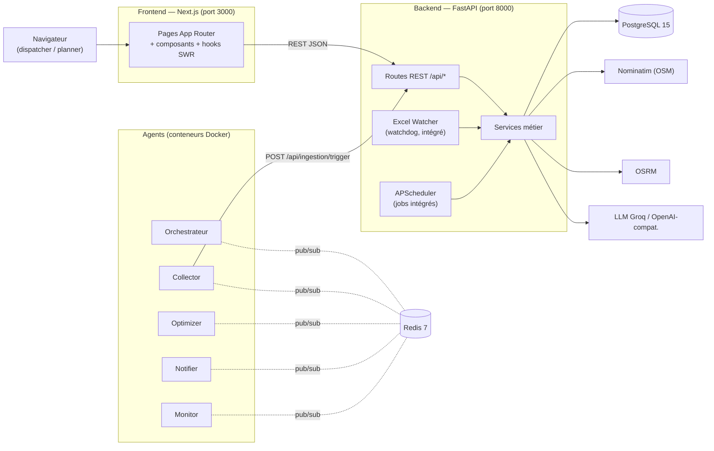
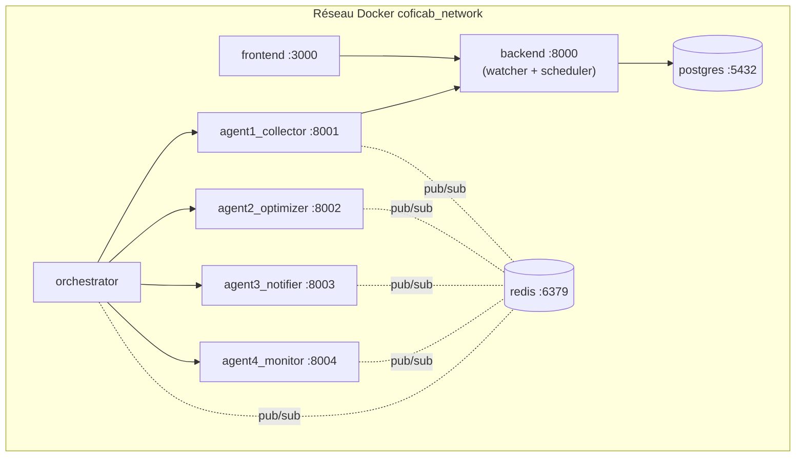

# Architecture de la plateforme CofICab OptiRoute — Dossier de réalisation

> Document de référence pour le **chapitre de réalisation** du mémoire.
> Toutes les affirmations sont **sourcées** dans le code (`chemin/fichier.py`).
> Date : 2026-06-16.

---

## 1. Vue d'ensemble & style architectural

La plateforme suit une architecture **multi-couches orientée services**, doublée
d'une **couche multi-agents événementielle**. Trois grands ensembles :

1. **Frontend** — application web *Next.js / React* (tableau de bord, planification,
   carte, copilot).
2. **Backend** — API *FastAPI* exposant la logique métier (ingestion, optimisation,
   exécution, KPI, copilot), avec un **ordonnanceur** et un **watcher de fichiers**
   embarqués.
3. **Couche agents** — quatre agents автonomes + un orchestrateur communiquant par
   **Redis pub/sub** (topologie microservices Docker), en parallèle des jobs
   équivalents embarqués dans le backend.

Le tout est **« offline-first »** : il démarre sur un poste sans base ni secrets
réels, mais bascule en mode strict dès `APP_ENV=production`
([backend/app/config.py](backend/app/config.py)).



---

## 2. Stack technique (versions exactes)

| Couche | Technologie | Version | Source |
|---|---|---|---|
| API | FastAPI | 0.116.0 | [backend/requirements.txt](backend/requirements.txt) |
| Serveur ASGI | Uvicorn | 0.24.0 | idem |
| ORM | SQLAlchemy | 2.0.34 | idem |
| Migrations | Alembic | 1.13.2 | idem |
| Driver PG | psycopg2-binary | 2.9.10 | idem |
| Validation | Pydantic | 2.13.4 | idem |
| Optimisation | OR-Tools | 9.15.6755 | idem |
| Données | pandas | 3.0.3 / openpyxl 3.1.5 | idem |
| Watcher | watchdog | 6.0.0 | idem |
| Ordonnanceur | APScheduler | 3.10.4 | idem |
| Bus d'événements | redis (client) | 5.0.0 | idem |
| Sécurité | python-jose 3.3.0 + bcrypt 4.1.1 | — | idem |
| LLM | openai (client) | 1.54.4 | idem |
| HTTP client | httpx 0.27.2 / requests 2.31.0 | — | idem |
| Frontend | Next.js | ^13.4 (App Router) | [frontend/package.json](frontend/package.json) |
| UI | React 18.2 + Tailwind 3.4 | — | idem |
| Cartographie | Leaflet 1.9.4 + react-leaflet 4.2.1 | — | idem |
| Graphiques | Recharts 2.8 | — | idem |
| Data-fetching | SWR 2.4 | — | idem |
| Drag & drop | @dnd-kit | — | idem |
| Conteneurisation | Docker Compose (PG, Redis, backend, frontend, orchestrateur, 4 agents) | — | [docker-compose.yml](docker-compose.yml) |

---

## 3. Architecture backend (couches & patterns)

Organisation en paquets sous [backend/app/](backend/app/) :

```
app/
├── main.py            # création FastAPI, CORS, lifespan (watcher+scheduler), montage des routers
├── config.py          # configuration/secret-handling (offline-first → strict en prod)
├── database.py        # engine SQLAlchemy + pool + sessions + mode offline
├── routes/            # COUCHE PRÉSENTATION : endpoints REST (1 fichier par domaine)
├── services/          # COUCHE MÉTIER : toute la logique (optimisation, KPI, ingestion…)
├── models/            # COUCHE DONNÉES : entités ORM SQLAlchemy
├── providers/         # adaptateurs externes (notification SMS — Strategy)
├── agents/            # jobs planifiés intégrés (scheduler + collector/optimizer/monitor/notifier)
├── observability.py   # métriques /metrics + logs structurés
└── rate_limit.py      # limitation de débit par IP
```

**Patron en couches strict** : `routes` (validation + auth + sérialisation) →
`services` (règles métier) → `models` (persistance). Les routes ne touchent jamais
directement la logique d'optimisation ; elles délèguent aux services.

**Injection de dépendances FastAPI** : la session DB et l'utilisateur courant sont
injectés via `Depends(get_db)` et `Depends(require_auth / require_role)`
([backend/app/services/auth_service.py](backend/app/services/auth_service.py)).

**Patron Strategy** pour les notifications : interface abstraite
`NotificationProvider` + implémentation `MockProvider`
([backend/app/providers/notification.py](backend/app/providers/notification.py)) —
on remplacerait par un `TwilioProvider` sans toucher au `DispatchService`.

**Cycle de vie applicatif** : le `lifespan` de FastAPI démarre le watcher de fichiers
et l'ordonnanceur au boot, et les arrête proprement à l'extinction
([backend/app/main.py](backend/app/main.py#L55), gates `WATCHER_ENABLED` /
`SCHEDULER_ENABLED`).

### Domaines exposés (routers montés dans `main.py`)
`auth`, `data`, `ingestion`, `optimization` (+ `daily_router`), `planning_governance`,
`delivery_split`, `execution`, `fleet` (+ `clients`), `incidents`, `dispatch`,
`tracking`, `agents`, `metrics`, `tasks`, `copilot`.

---

## 4. Architecture frontend (Next.js App Router)

Sous [frontend/](frontend/) :

```
app/                # routes (App Router) : 1 dossier = 1 page
├── dashboard, ai-monitor, planning, daily-planning,
│   generated-daily-planning, generated-planning, map,
│   clients, ressources, admin, drivers, vehicles, analytics,
│   transport/[id]
├── layout.jsx      # layout racine (AppShell global)
└── services/api.ts # CLIENT API CENTRALISÉ (fetch + JWT + base URL)
components/
├── layout/         # AppShell, Sidebar, RootProvider, DemoDataBanner
├── planning/       # Gantt, RouteMap, ControlTower*, panneaux décisionnels…
├── map/            # ClientMap, TruckMap (Leaflet)
├── chat/           # CopilotLauncher, ChatPanel (streaming)
└── charts/         # Recharts
hooks/              # useKpi, useFleet, useDailyDashboard, useWeeklyDeliveries (SWR)
data/               # jeux de démonstration (fallback offline)
```

**Flux de données** : composants/hooks → `app/services/api.ts` (fonction `request()`
unique : ajoute l'en-tête `Authorization: Bearer` depuis `localStorage`, gère la base
URL `NEXT_PUBLIC_API_URL`, parse les erreurs) → API backend
([frontend/app/services/api.ts](frontend/app/services/api.ts)).

**Cache & rafraîchissement** : SWR (`stale-while-revalidate`) dans les hooks
(`hooks/useKpi.ts`, etc.).

**Copilot en streaming** : `streamCopilotChat()` lit la réponse par *chunks*
(`ReadableStream`) pour un affichage token-par-token.

**Carte** : Leaflet/react-leaflet ; géométrie de route via OSRM ; accessible depuis la
page `/map` et les panneaux Control-Tower.

> ⚠️ **Point d'honnêteté pour le mémoire** : il n'y a pas de page de *login* côté
> frontend ; en développement, l'absence de jeton retombe sur l'utilisateur `dev`
> (admin) — le contrôle de rôle est appliqué **côté backend**, endpoint par endpoint
> (cf. §9).

---

## 5. Persistance des données

- **SGBD** : PostgreSQL 15 ([docker-compose.yml](docker-compose.yml)), schéma initial
  injecté depuis `database/schema.sql` + `database/seed.sql` au premier démarrage.
- **ORM** : SQLAlchemy 2.0, `declarative_base` ([backend/app/database.py](backend/app/database.py)).
- **Pool de connexions** : `pool_size=5`, `max_overflow=10`, `pool_pre_ping=True`,
  `pool_recycle=300 s` (résilience aux coupures).
- **Mode offline** : si la connexion échoue, `engine=None` et `SessionLocal` devient
  une fabrique factice ; les endpoints « optionnels » (`get_db_optional`) renvoient des
  données de démonstration au lieu de planter.
- **Migrations** : Alembic ([backend/alembic/](backend/alembic/)) ;
  `Base.metadata.create_all()` dans `main.py` n'est qu'un filet de sécurité
  offline/tests.
- **23–24 tables** (référentiel, opérationnel, KPI, gouvernance/audit) — détaillées dans
  [docs/MODELE_ENTITE_RELATION.md](docs/MODELE_ENTITE_RELATION.md).

---

## 6. Pipeline d'ingestion (Watchdog)

Le cœur de l'automatisation : déposer un classeur Excel suffit à déclencher tout le
traitement. **Deux implémentations coexistent** :

| | Watcher intégré | Agent collector autonome |
|---|---|---|
| Fichier | [backend/app/services/excel_watcher.py](backend/app/services/excel_watcher.py) | [agents/agent1_collector/main.py](agents/agent1_collector/main.py) |
| Exécution | thread dans le backend (lifespan) | conteneur Docker séparé (port santé 8001) |
| Détection | `watchdog.Observer` sur `weekly planning/` | `watchdog.Observer` sur `/data/watch` |
| Action | parse + insère + crée la `PlanningVersion` | POST `/api/ingestion/trigger` + publie `data_ready` sur Redis |

**Validation** (multi-niveaux) : colonnes requises `['driver','vehicle','start','end',
'distance']`, validation ligne à ligne (champs non vides, `distance>0`) ; à l'upload
([backend/app/routes/ingestion.py](backend/app/routes/ingestion.py)) : extension `.xlsx`,
type MIME, **magic bytes `PK\x03\x04`**, taille ≤ 25 Mo. Chaque import est tracé dans
`ingestion_logs` (statut `success/partial/failed`).

---

## 7. Couche agents & orchestration

> **À expliciter dans le mémoire** : la plateforme matérialise le concept « multi-agents »
> sous **deux formes complémentaires**.

**(a) Agents intégrés** — jobs APScheduler dans le backend
([backend/app/agents/scheduler.py](backend/app/agents/scheduler.py)) :

| Job | Cadence | Réel / stub |
|---|---|---|
| `collector.run` | toutes les 15 min | stub (log) |
| `optimizer.run` | cron 06:00 | réel |
| `kpi_jobs.run_daily` | cron 23:30 | réel (peuple `kpi_journalier`) |
| `kpi_jobs.run_monthly` | cron 1er du mois 02:00 | réel (`kpi_mensuel`) |
| `monitor.run` | toutes les 30 s | **réel** — crée des incidents `RETARD_TRAFIC` |
| `notifier.flush` | toutes les 10 s | stub (log) |

**(b) Agents microservices** — conteneurs Docker indépendants communiquant par
**Redis pub/sub**, supervisés par l'**orchestrateur**
([orchestrator/main.py](orchestrator/main.py)) qui les démarre comme sous-processus,
les **redémarre** s'ils tombent, et publie les déclencheurs planifiés (15h00/15h05) via
APScheduler. Chaque agent expose un endpoint `/health` (ports 8001-8004) :
- **Collector** (8001) — surveille le dossier, déclenche l'ingestion, publie `data_ready`
- **Optimizer** (8002) — réagit aux événements, lance l'optimisation
- **Notifier** (8003) — émet les alertes/notifications
- **Monitor** (8004) — détection d'anomalies / retards

> ⚠️ **Nuance importante** : le flux affiché par le tableau de bord *AI-Monitor*
> (`GET /api/agents/status`) est un **flux de démonstration simulé**
> ([backend/app/routes/agents.py](backend/app/routes/agents.py)) — il illustre le
> comportement attendu (events `data_ready`, `optimization_complete`, …) mais ne
> reflète pas l'état réel des processus agents. À présenter comme tel.

---

## 8. Moteur d'optimisation (cœur algorithmique)

**Classe canonique** : `DailyPlanBuilder`
([backend/app/services/daily_plan_builder.py](backend/app/services/daily_plan_builder.py)).
Résout un **VRPTW multi-véhicules global** avec OR-Tools :

- 1 nœud par livraison (nœud 0 = dépôt), tous les véhicules ancrés au dépôt ;
- **3 dimensions de capacité** : positions/palettes, **kg**, **m³** (les bobines
  « cubent ») ;
- **dimension temps** : trajet + service, fenêtres horaires client, heure-limite de
  départ, retours tardifs autorisés ;
- **multi-tournées** : chaque camion répliqué en *N* créneaux véhicule chaînés ;
- **abandons via disjonctions** (urgent quasi-obligatoire) + terme **makespan**
  (parallélisme / fin de journée tôt) ;
- **modes objectif** `green / balanced / fast` (frontière coût-CO₂ ↔ délai), portfolio
  *coverage-first* qui n'abandonne jamais un client servable ;
- **repli heuristique** (clustering K-means++ + insertion gloutonne) si OR-Tools est
  indisponible ([backend/app/services/vrptw_optimizer.py](backend/app/services/vrptw_optimizer.py)).

**Coût** réel en TND (carburant, chauffeur, camion, sous-utilisation, pénalité d'abandon)
calculé par `_cost_breakdown` — c'est le score que le solveur minimise et la facture
affichée.

> Deux optimiseurs *legacy* subsistent pour des chemins non-workbook (`VrptwOptimizer`
> DB, `VRPTWOptimizer` dict) — le builder est l'autorité.

---

## 9. Sécurité

| Mécanisme | Implémentation | Fichier |
|---|---|---|
| Authentification | JWT HS256, expiration 30 min | [auth_service.py](backend/app/services/auth_service.py) |
| Mots de passe | bcrypt (troncature 72 octets) | idem |
| Rôles | `viewer / planner / admin` via `require_role` / `require_auth` | idem + [routes/auth.py](backend/app/routes/auth.py) |
| Anti-brute-force | verrouillage (IP, username) après N échecs | [rate_limit.py](backend/app/rate_limit.py) |
| Limitation de débit | par IP, budget serré pour solveur/LLM | idem |
| Durcissement upload | extension + MIME + magic bytes + taille | [routes/ingestion.py](backend/app/routes/ingestion.py) |
| Secrets en prod | refus des placeholders JWT / DSN par défaut | [config.py](backend/app/config.py) |
| CORS | origines localhost + regex | [main.py](backend/app/main.py#L93) |

Principe de **moindre privilège** : un jeton sans claim de rôle est traité comme
`viewer`. En production (`APP_ENV=production`), l'accès anonyme est rejeté ; en dev, il
retombe sur l'utilisateur `dev` admin (bypass désactivable par `REQUIRE_AUTH`).

---

## 10. Observabilité

[backend/app/observability.py](backend/app/observability.py) — sans dépendance externe :
- **Métriques** : middleware HTTP mesurant chaque requête (compteurs, histogramme de
  latence, jauge *in-flight*), clé = **template de route** (faible cardinalité). Exposé
  en format **Prometheus** sur `/metrics` et en JSON sur `/metrics.json`. La latence par
  endpoint sert aussi de **télémétrie du solveur** (ex. `/api/planning/daily/generate`).
- **Logs structurés** JSON optionnels (`LOG_JSON=1`), log d'accès optionnel (`LOG_ACCESS`).

---

## 11. Aide à la décision (couche analytique au-dessus du plan)

Modules distincts du routage, exposés par `daily_router`
([backend/app/routes/optimization.py](backend/app/routes/optimization.py)) :

| Fonction | Endpoint | Service |
|---|---|---|
| Pareto / modes objectif | `/daily/pareto` | `DailyPlanBuilder` |
| Carbone & ESG | `/daily/esg-report` | `_sustainability()` |
| Stress-test (scénarios de demande) | `/daily/stress-test` | `simulation_service` |
| Confiance Monte-Carlo (OTIF, P50/P90) | `/daily/confidence` | [simulation_service.py](backend/app/services/simulation_service.py) |
| Control-Tower live + alertes prédictives | `/daily/control-tower` | [control_tower.py](backend/app/services/control_tower.py) |
| Explication / Replan | `/daily/explain`, `/daily/replan` | `DailyPlanBuilder.replan()` |

---

## 12. Copilot LLM (Optiroute)

[backend/app/services/copilot_service.py](backend/app/services/copilot_service.py) :
client **OpenAI-compatible** ciblant **Groq (Llama 3.3 70B)** par défaut. Architecture
**agentique** : le modèle dispose d'**outils en lecture seule** sur l'API de la
plateforme (KPI, flotte, plan, incidents, tracking…) plus un *escape hatch*
`query_platform`. Boucle d'appels d'outils plafonnée (`MAX_TOOL_ITERATIONS`), réponse en
**streaming**. Dégradation gracieuse (503) si aucune clé n'est configurée.

---

## 13. Vue de déploiement (Docker Compose)

Stack complète en une commande (`docker compose up -d`,
[docker-compose.yml](docker-compose.yml)) — réseau `coficab_network` :

| Service | Image / build | Port | Rôle |
|---|---|---|---|
| postgres | postgres:15-alpine | 5432 | base + init schema/seed |
| redis | redis:7-alpine | 6379 | bus pub/sub des agents |
| backend | build ./backend | 8000 | API + watcher + scheduler |
| frontend | build ./frontend | 3000 | tableau de bord |
| orchestrator | build ./orchestrator | — | démarre/supervise les agents |
| agent1_collector | build | 8001 | surveillance fichiers |
| agent2_optimizer | build | 8002 | optimisation |
| agent3_notifier | build | 8003 | notifications |
| agent4_monitor | build | 8004 | surveillance/anomalies |

Chaque service a un **healthcheck** ; les dépendances utilisent `condition:
service_healthy`. Mode développement alternatif (sans Docker) documenté dans le README
(backend `uvicorn`, frontend `npm run dev`, agents en terminaux séparés).



---

## 14. Flux de bout en bout (scénario nominal)

```mermaid
sequenceDiagram
    autonumber
    participant CC as Chargé Client
    participant W as Watcher / Collector
    participant API as Backend (services)
    participant DB as PostgreSQL
    participant OPT as DailyPlanBuilder (OR-Tools)
    participant RT as Resp. Transport
    participant DRV as Chauffeur

    CC->>W: dépose le classeur Excel
    W->>API: ingestion (parse + validation Pydantic/pandas)
    API->>DB: insertion livraisons + PlanningVersion + ingestion_log
    RT->>API: POST /api/planning/daily/generate
    API->>OPT: résolution VRPTW (capacité+temps+CO₂)
    OPT-->>API: plan (tournées, KPI, durabilité, diagnostics)
    API-->>RT: plan affiché (Gantt + carte)
    RT->>API: ajustements glisser-déposer + validation
    API->>DB: PlanVersion VALIDE + missions
    API->>DRV: briefing SMS (MockProvider → notification_log)
    DRV->>API: ePOD (confirmation / exception)
    API->>DB: DemandeLocal LIVREE + livree_a_temps
    Note over API,DB: kpi_jobs (23h30) agrège OTIF/OTD/CO₂ → kpi_journalier
```

---

## 15. Points de vigilance à assumer devant le jury

1. **Deux lignées de données** sans clé étrangère formelle : flux Excel
   (`planning_versions`/`livraisons`) vs flux opérationnel
   (`demandes_local`/`plan_version`) — cf. [docs/MODELE_ENTITE_RELATION.md](docs/MODELE_ENTITE_RELATION.md) §11.
2. **Deux topologies d'agents** (intégrée vs microservices) — choix de souplesse
   dev/prod, à présenter comme tel.
3. **`/api/agents/status` simulé** (démo), distinct des agents réels.
4. **SMS chauffeur = `MockProvider`** (pas de Twilio réel) — interface prête, intégration
   future.
5. **Pas de page de login frontend** ; RBAC appliqué côté API.

Ces choix sont cohérents avec un **prototype/MVP** privilégiant la démonstration du
pipeline d'automatisation et de la valeur décisionnelle.
