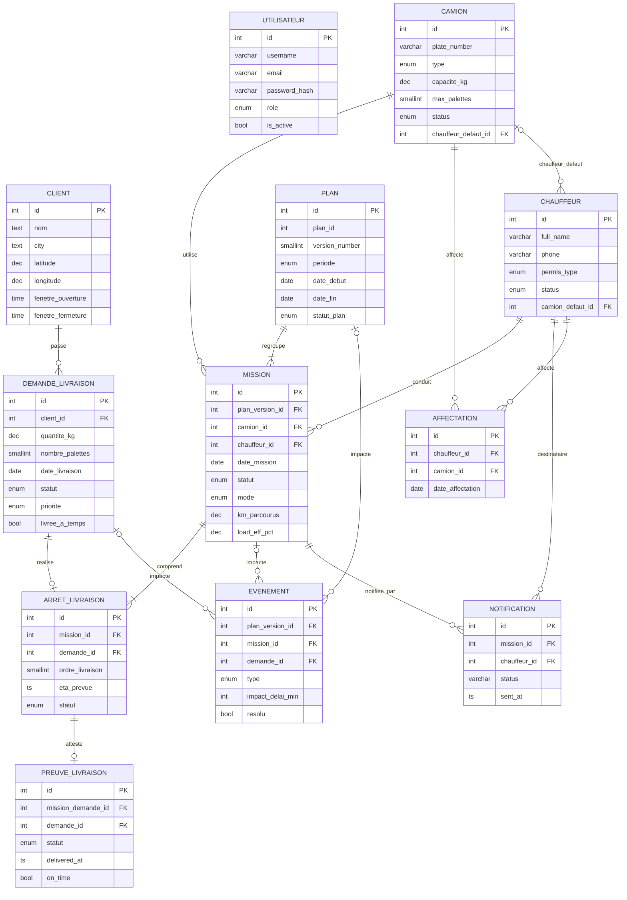
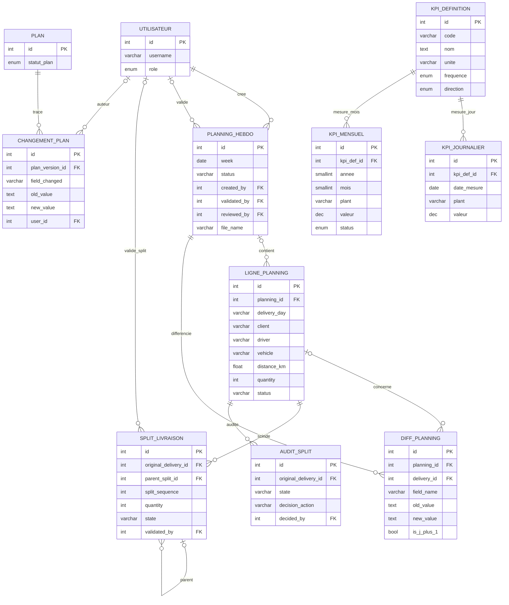

# Modèle Entité-Relation — Plateforme CofICab OptiRoute

> **Document de conception de données — version « soutenance / jury »**
> Méthode : **Merise** (MCD → MLD), formalisme des cardinalités **(min, max)**.
> Périmètre : entités **métier** de la plateforme de planification et d'exécution
> du transport COFICAB (dépôt Sidi Hassine → usines clientes).
> Source : modèles SQLAlchemy `backend/app/models/*` + `database/schema.sql`.
> Date : 2026-06-15.

---

## 1. Méthodologie & conventions

| Élément | Convention retenue |
|---|---|
| Méthode | Merise — Modèle Conceptuel de Données (MCD) puis Modèle Logique (MLD relationnel) |
| Cardinalités | Couple **(min, max)** lu **du côté de l'entité** : `(0,1)`, `(1,1)`, `(0,n)`, `(1,n)` |
| Identifiant | Souligné dans le MCD ; noté **PK** dans le dictionnaire et le MLD |
| Clé étrangère | Préfixe **`#`** dans le MLD (ex. `#client_id`) |
| Entité associative | Association porteuse de données **réifiée** (identifiant propre) — ex. `ARRET_LIVRAISON`, `AFFECTATION` |
| CIF | Contrainte d'Intégrité Fonctionnelle (dépendance d'un côté `(x,1)`) |
| Normalisation | Cible **3FN / BCNF** ; les dénormalisations volontaires sont listées au §9 |

**Légende cardinalités Merise :**
`(0,1)` = facultatif, au plus un · `(1,1)` = obligatoire, exactement un ·
`(0,n)` = facultatif, plusieurs · `(1,n)` = obligatoire, plusieurs.

---

## 2. Règles de gestion (RG)

Les règles ci-dessous **justifient chaque cardinalité** du MCD.

| # | Règle de gestion |
|---|---|
| RG01 | Un **client** peut faire l'objet de plusieurs **demandes de livraison** ; une demande concerne **un seul** client. |
| RG02 | Une **demande de livraison** a un état (`NOUVELLE → PLANIFIEE → EN_COURS → LIVREE / ANNULEE`) et une priorité (`NORMALE / HAUTE / URGENTE`). |
| RG03 | Un **plan de transport** couvre une **période** (`JOUR / SEMAINE / MOIS`) et regroupe **une ou plusieurs missions**. |
| RG04 | Une **mission** appartient à **un seul** plan, et est réalisée par **exactement un camion** et **exactement un chauffeur**. |
| RG05 | Une mission **comprend un ou plusieurs arrêts** ordonnés ; chaque arrêt **réalise exactement une** demande. |
| RG06 | Une demande est planifiée dans **au plus un** arrêt (unicité de service). |
| RG07 | Un arrêt peut donner lieu à **au plus une preuve de livraison** (ePOD) ; une preuve atteste **exactement un** arrêt. |
| RG08 | Un **événement aléatoire** (incident) peut être rattaché à **au plus** un plan, **au plus** une mission et **au plus** une demande (rattachement facultatif et multiple). |
| RG09 | Une **notification** (briefing chauffeur) concerne **exactement une** mission et **exactement un** chauffeur. |
| RG10 | Un camion et un chauffeur peuvent être liés par une **affectation datée** ; l'historique des affectations est conservé. |
| RG11 | Un camion peut avoir **un chauffeur par défaut** (et réciproquement) — relation facultative. |
| RG12 | Un **planning hebdomadaire** (classeur Excel ingéré) est **créé par** un utilisateur, peut être **validé** et **revu** par un utilisateur, et contient **plusieurs lignes de planning**. |
| RG13 | Toute **modification** d'un planning validé est **tracée** (différentiel + journal d'audit horodaté et nominatif). |
| RG14 | Une **ligne de planning** dont la quantité dépasse la capacité du plus gros camion peut être **scindée** (split) ; chaque décision de split est **auditée** (traçabilité IATF 16949). |
| RG15 | Un **indicateur (KPI)** est défini une fois, puis **mesuré** quotidiennement et mensuellement par usine (`plant`). |
| RG16 | Toute modification d'un **plan opérationnel** est tracée (champ modifié, ancienne/nouvelle valeur, motif, auteur). |
| RG17 | Un **utilisateur** possède un rôle unique (`viewer / planner / admin`) régissant ses droits. |

---

## 3. Liste des entités

| Code (table) | Entité métier | Sous-domaine |
|---|---|---|
| `users` | **UTILISATEUR** | Référentiel |
| `clients` | **CLIENT** | Référentiel |
| `camions` | **CAMION** | Référentiel |
| `chauffeurs` | **CHAUFFEUR** | Référentiel |
| `demandes_local` | **DEMANDE_LIVRAISON** | Demande |
| `plan_version` | **PLAN** | Planification & exécution |
| `plan_mission` | **MISSION** | Planification & exécution |
| `mission_demande` | **ARRET_LIVRAISON** *(associative)* | Planification & exécution |
| `livraison_preuve` | **PREUVE_LIVRAISON** (ePOD) | Planification & exécution |
| `evenement_alea` | **EVENEMENT** | Supervision & aléas |
| `notification_log` | **NOTIFICATION** | Supervision & aléas |
| `affectation_chauffeur` | **AFFECTATION** *(associative)* | Référentiel / RH |
| `planning_versions` | **PLANNING_HEBDO** | Source & gouvernance |
| `livraisons` | **LIGNE_PLANNING** | Source & gouvernance |
| `planning_diffs` | **DIFF_PLANNING** | Source & gouvernance |
| `planning_change_logs` | **CHGT_PLANNING_HEBDO** | Source & gouvernance |
| `delivery_splits` | **SPLIT_LIVRAISON** | Source & gouvernance |
| `delivery_split_audits` | **AUDIT_SPLIT** | Source & gouvernance |
| `planning_change_log` | **CHANGEMENT_PLAN** | Gouvernance (plan opér.) |
| `kpi_definition` | **KPI_DEFINITION** | Pilotage / KPI |
| `kpi_journalier` | **KPI_JOURNALIER** | Pilotage / KPI |
| `kpi_mensuel` | **KPI_MENSUEL** | Pilotage / KPI |
| `ingestion_logs` | **JOURNAL_INGESTION** *(technique)* | Source & gouvernance |
| `transport_tracking` | **SUIVI_TRANSPORT** *(technique)* | Supervision |

> Les entités marquées *(technique)* sont des journaux d'exploitation ; elles ne
> portent pas de logique métier conceptuelle forte et sont exclues du MCD cœur.

---

## 4. Dictionnaire des données (entités métier)

Notation des types : `INT` entier · `SMALLINT` entier court · `DEC(p,s)` décimal ·
`VARCHAR(n)` chaîne · `TEXT` texte long · `BOOL` booléen · `DATE` · `TIME` heure ·
`TS` horodatage avec fuseau · `ENUM{…}` domaine énuméré.

### 4.1 UTILISATEUR (`users`)
| Attribut | Type | Contrainte | Description |
|---|---|---|---|
| id | INT | **PK** | Identifiant |
| username | VARCHAR(50) | UNIQUE, NOT NULL | Identifiant de connexion |
| email | VARCHAR(100) | UNIQUE, NOT NULL | Courriel |
| password_hash | VARCHAR(255) | NOT NULL | Empreinte bcrypt |
| role | VARCHAR(30) | NOT NULL, déf. `viewer` | `viewer / planner / admin` |
| is_active | BOOL | déf. true | Compte actif |
| date_creation | TS | déf. now | Création |

### 4.2 CLIENT (`clients`)
| Attribut | Type | Contrainte | Description |
|---|---|---|---|
| id | INT | **PK** | Code client métier (PK manuelle) |
| nom | TEXT | NOT NULL | Raison sociale |
| address / city / country | TEXT | — | Localisation postale |
| email | VARCHAR(100) | — | Contact |
| numero | VARCHAR(30) | — | Téléphone |
| latitude / longitude | DEC(9,6) | — | Coordonnées géographiques |
| fenetre_ouverture / fenetre_fermeture | TIME | — | Fenêtre horaire de réception |
| exigences | TEXT | — | Contraintes spécifiques |
| date_creation | TS | déf. now | Création |

### 4.3 CAMION (`camions`)
| Attribut | Type | Contrainte | Description |
|---|---|---|---|
| id | INT | **PK** | Identifiant |
| plate_number | VARCHAR(20) | UNIQUE, NOT NULL | Immatriculation |
| type | ENUM{SEMI, PORTEUR, FOURGON, TAUTLINER} | NOT NULL | Type de véhicule |
| capacite_kg | DEC(10,2) | NOT NULL | Charge utile (kg) |
| max_palettes | SMALLINT | NOT NULL | Capacité en positions/palettes |
| status | ENUM{DISPONIBLE, EN_MISSION, MAINTENANCE, PANNE} | NOT NULL | État |
| consommation_base_l_100km | DEC(5,2) | — | Consommation de référence |
| #chauffeur_defaut_id | INT | FK→CHAUFFEUR (0,1) | Chauffeur par défaut (RG11) |
| date_creation | TS | déf. now | Création |

### 4.4 CHAUFFEUR (`chauffeurs`)
| Attribut | Type | Contrainte | Description |
|---|---|---|---|
| id | INT | **PK** | Matricule interne |
| full_name | VARCHAR | NOT NULL | Nom complet |
| phone | VARCHAR(30) | — | Téléphone (briefing) |
| permis_type | ENUM{B, C, CE, D} | NOT NULL | Catégorie de permis |
| permis_numero | VARCHAR(50) | — | N° de permis |
| status | ENUM{ACTIF, CONGE, ARRET_MALADIE, INACTIF} | NOT NULL | Disponibilité |
| #camion_defaut_id | INT | FK→CAMION (0,1) | Camion par défaut (RG11) |
| shift_start / shift_end | TIME | — | Plage de travail |
| date_creation | TS | déf. now | Création |

### 4.5 DEMANDE_LIVRAISON (`demandes_local`)
| Attribut | Type | Contrainte | Description |
|---|---|---|---|
| id | INT | **PK** | Identifiant |
| #client_id | INT | FK→CLIENT, NOT NULL | Donneur d'ordre (RG01) |
| quantite_kg | DEC(10,2) | NOT NULL | Quantité demandée (kg) |
| nombre_palettes | SMALLINT | — | Quantité en positions |
| date_livraison | DATE | NOT NULL | Date prévue |
| heure_arrivee_prevue / _reelle | TS | — | ETA prévu / réel |
| quantite_livree_kg | DEC(10,2) | — | Quantité livrée (actual) |
| commentaire | TEXT | — | Note (peut décrire un split) |
| statut | ENUM{NOUVELLE, PLANIFIEE, EN_COURS, LIVREE, ANNULEE} | NOT NULL | Cycle de vie (RG02) |
| priorite | ENUM{NORMALE, HAUTE, URGENTE} | NOT NULL | Priorité (RG02) |
| livree_a_temps | BOOL | — | OTIF/OTD |
| source_import | VARCHAR(50) | — | Origine (manuel / fichier) |
| date_creation | TS | déf. now | Création |

### 4.6 PLAN (`plan_version`)
| Attribut | Type | Contrainte | Description |
|---|---|---|---|
| id | INT | **PK** | Identifiant technique |
| plan_id | INT | NOT NULL | N° de plan métier |
| version_number | SMALLINT | NOT NULL | N° de version |
| periode | ENUM{JOUR, SEMAINE, MOIS} | NOT NULL | Granularité (RG03) |
| date_debut / date_fin | DATE | NOT NULL | Bornes (date_debut ≤ date_fin) |
| statut_plan | ENUM{DRAFT, EN_REVUE, VALIDE, EXECUTE, CLOTURE} | NOT NULL | Cycle de vie |
| date_creation / date_validation | TS | — | Horodatage |
| valide_par | VARCHAR(100) | — | Validateur |
| commentaire | TEXT | — | Note |
| | | UNIQUE(plan_id, version_number) | Clé candidate |

### 4.7 MISSION (`plan_mission`)
| Attribut | Type | Contrainte | Description |
|---|---|---|---|
| id | INT | **PK** | Identifiant |
| #plan_version_id | INT | FK→PLAN, NOT NULL | Plan parent (RG04) |
| #camion_id | INT | FK→CAMION, NOT NULL | Véhicule (RG04) |
| #chauffeur_id | INT | FK→CHAUFFEUR, NOT NULL | Conducteur (RG04) |
| date_mission | DATE | NOT NULL | Jour de la tournée |
| heure_sortie_prevue / _reelle | TS | — | Départ prévu / réel |
| heure_retour_prevue / _reelle | TS | — | Retour prévu / réel |
| statut | ENUM{PLANIFIEE, EN_COURS, TERMINEE, ANNULEE} | NOT NULL | Cycle de vie |
| mode | ENUM{NORMAL, PREMIUM} | NOT NULL | Mode de transport |
| km_parcourus / km_a_vide | DEC(8,2) | — | Distances |
| charge_kg / charge_palettes | DEC / SMALLINT | — | Charge embarquée |
| fuel_consomme_l | DEC(8,2) | — | Carburant |
| cout_consommables/emballage/transport/premium_eur | DEC(10,2) | — | Coûts |
| load_eff_kg/pallets/_pct | DEC(5,2) | — | Taux de remplissage |

### 4.8 ARRET_LIVRAISON (`mission_demande`) — entité associative
| Attribut | Type | Contrainte | Description |
|---|---|---|---|
| id | INT | **PK** | Identifiant de l'arrêt |
| #mission_id | INT | FK→MISSION, NOT NULL | Tournée (RG05) |
| #demande_id | INT | FK→DEMANDE_LIVRAISON, NOT NULL | Demande servie (RG05) |
| ordre_livraison | SMALLINT | NOT NULL | Rang de passage |
| eta_prevue / eta_reelle | TS | — | ETA prévu / réel |
| statut | ENUM{NOUVELLE, PLANIFIEE, EN_COURS, LIVREE, ANNULEE} | NOT NULL | État de l'arrêt |
| | | UNIQUE(mission_id, ordre_livraison) | Pas deux arrêts au même rang |

### 4.9 PREUVE_LIVRAISON (`livraison_preuve`) — ePOD
| Attribut | Type | Contrainte | Description |
|---|---|---|---|
| id | INT | **PK** | Identifiant |
| #mission_demande_id | INT | FK→ARRET_LIVRAISON, NOT NULL | Arrêt attesté (RG07) |
| #demande_id | INT | FK→DEMANDE_LIVRAISON, NOT NULL | Demande *(redondant — cf. §9)* |
| statut | ENUM{LIVREE, PARTIELLE, REFUSEE} | NOT NULL | Résultat |
| delivered_at | TS | NOT NULL | Horodatage livraison |
| quantite_livree_kg | DEC(10,2) | — | Quantité réelle |
| on_time | BOOL | — | Dans la fenêtre |
| signataire | VARCHAR(120) | — | Réceptionnaire |
| photo_url | TEXT | — | Preuve photo |
| notes | TEXT | — | Observations |
| created_by | VARCHAR(80) | — | Saisi par |

### 4.10 EVENEMENT (`evenement_alea`)
| Attribut | Type | Contrainte | Description |
|---|---|---|---|
| id | INT | **PK** | Identifiant |
| #plan_version_id | INT | FK→PLAN (0,1) | Plan impacté (RG08) |
| #mission_id | INT | FK→MISSION (0,1) | Mission impactée (RG08) |
| #demande_id | INT | FK→DEMANDE_LIVRAISON (0,1) | Demande impactée (RG08) |
| type | ENUM{PANNE_VEHICULE, RETARD_TRAFIC, CLIENT_INDISPONIBLE, DEPASSEMENT_CAPACITE, DEMANDE_LAST_MINUTE, CLIENT_COMPLAINT} | NOT NULL | Nature |
| description | TEXT | — | Détail |
| date_evenement | TS | NOT NULL | Survenance |
| impact_delai_min | INT | déf. 0 | Retard induit |
| resolu | BOOL | déf. false | Résolu |
| date_resolution | TS | — | Résolution |
| cause | TEXT | — | Cause racine |

### 4.11 NOTIFICATION (`notification_log`)
| Attribut | Type | Contrainte | Description |
|---|---|---|---|
| id | INT | **PK** | Identifiant |
| #mission_id | INT | FK→MISSION, NOT NULL | Mission (RG09) |
| #chauffeur_id | INT | FK→CHAUFFEUR, NOT NULL | Destinataire (RG09) |
| status | VARCHAR(20) | NOT NULL | `sent / failed / skipped` |
| error | TEXT | — | Erreur éventuelle |
| body | TEXT | — | Contenu du briefing |
| sent_at | TS | déf. now | Envoi |

### 4.12 AFFECTATION (`affectation_chauffeur`) — entité associative
| Attribut | Type | Contrainte | Description |
|---|---|---|---|
| id | INT | **PK** | Identifiant |
| #chauffeur_id | INT | FK→CHAUFFEUR, NOT NULL | Chauffeur (RG10) |
| #camion_id | INT | FK→CAMION, NOT NULL | Camion (RG10) |
| date_affectation | DATE | NOT NULL | Date d'affectation |

> *Sous-domaines gouvernance/pilotage (résumé) :*
> **PLANNING_HEBDO** (`planning_versions` : week, status∈{DRAFT, VALIDATED, …}, #created_by, #validated_by, #reviewed_by, file_name, excel_path, source) ·
> **LIGNE_PLANNING** (`livraisons` : #planning_id (0,1), delivery_day, client, driver, vehicle, start/end_location, distance_km, quantity, status, priority, notes) ·
> **DIFF_PLANNING** (`planning_diffs` : #planning_id, #delivery_id, field_name, old/new_value, impact_eta/cost/risk, is_j_plus_1) ·
> **SPLIT_LIVRAISON** (`delivery_splits` : #original_delivery_id, #parent_split_id (0,1), split_sequence, quantity, state, #validated_by) ·
> **AUDIT_SPLIT** (`delivery_split_audits` : #original_delivery_id, state, proposal_json, decision_action, #decided_by) ·
> **CHANGEMENT_PLAN** (`planning_change_log` : #plan_version_id, field_changed, old/new_value, reason_category, #user_id) ·
> **KPI_DEFINITION / KPI_JOURNALIER / KPI_MENSUEL** (référentiel + mesures par `plant`).

---

## 5. Associations du MCD (cardinalités Merise)

| Association | Entité A (min,max) | — | Entité B (min,max) | Attributs portés |
|---|---|---|---|---|
| **PASSER** | DEMANDE_LIVRAISON (1,1) | — | CLIENT (0,n) | — |
| **REGROUPER** | MISSION (1,1) | — | PLAN (1,n) | — |
| **UTILISER** | MISSION (1,1) | — | CAMION (0,n) | — |
| **CONDUIRE** | MISSION (1,1) | — | CHAUFFEUR (0,n) | — |
| **COMPRENDRE** | ARRET_LIVRAISON (1,1) | — | MISSION (1,n) | — |
| **REALISER** | ARRET_LIVRAISON (1,1) | — | DEMANDE_LIVRAISON (0,1) | — |
| **ATTESTER** | PREUVE_LIVRAISON (1,1) | — | ARRET_LIVRAISON (0,1) | — |
| **IMPACTER_PLAN** | EVENEMENT (0,1) | — | PLAN (0,n) | — |
| **IMPACTER_MISSION** | EVENEMENT (0,1) | — | MISSION (0,n) | — |
| **IMPACTER_DEMANDE** | EVENEMENT (0,1) | — | DEMANDE_LIVRAISON (0,n) | — |
| **NOTIFIER_MISSION** | NOTIFICATION (1,1) | — | MISSION (0,n) | — |
| **NOTIFIER_CHAUFFEUR** | NOTIFICATION (1,1) | — | CHAUFFEUR (0,n) | — |
| **AFFECTER (camion)** | AFFECTATION (1,1) | — | CAMION (0,n) | date_affectation |
| **AFFECTER (chauffeur)** | AFFECTATION (1,1) | — | CHAUFFEUR (0,n) | |
| **CHAUFFEUR_DEFAUT** | CAMION (0,1) | — | CHAUFFEUR (0,n) | — |
| **CAMION_DEFAUT** | CHAUFFEUR (0,1) | — | CAMION (0,n) | — |
| **CREER_PLANNING** | PLANNING_HEBDO (1,1) | — | UTILISATEUR (0,n) | — |
| **VALIDER_PLANNING** | PLANNING_HEBDO (0,1) | — | UTILISATEUR (0,n) | validated_at |
| **CONTENIR_LIGNE** | LIGNE_PLANNING (0,1) | — | PLANNING_HEBDO (0,n) | — |
| **DIFFERENCIER** | DIFF_PLANNING (1,1) | — | PLANNING_HEBDO (0,n) | — |
| **SCINDER** | SPLIT_LIVRAISON (1,1) | — | LIGNE_PLANNING (0,n) | — |
| **HIERARCHIE_SPLIT** | SPLIT_LIVRAISON (0,1) | — | SPLIT_LIVRAISON (0,n) | (réflexive) |
| **TRACER_PLAN** | CHANGEMENT_PLAN (1,1) | — | PLAN (0,n) | — |
| **AUTEUR_CHGT** | CHANGEMENT_PLAN (0,1) | — | UTILISATEUR (0,n) | — |
| **MESURER_JOUR** | KPI_JOURNALIER (1,1) | — | KPI_DEFINITION (0,n) | — |
| **MESURER_MOIS** | KPI_MENSUEL (1,1) | — | KPI_DEFINITION (0,n) | — |

---

## 6. Diagramme MCD — Cœur métier *(MCD principal de soutenance)*

---

## 7. Annexe A — Diagramme MCD Gouvernance & Pilotage *(hors MCD principal)*

> Présenté en **annexe** : sous-domaines de gouvernance documentaire (planning
> hebdomadaire, différentiels, splits, audits) et de pilotage (KPI). Le MCD de
> soutenance reste le **cœur métier (§6)**.

> **Correspondance notation patte-d'oie ↔ Merise** (lecture côté entité opposée) :
> `||` = (1,1) · `o{` = (0,n) · `|{` = (1,n) · `o|` = (0,1) · `|o` = (0,1).

---

## 8. Modèle Logique de Données (MLD relationnel)

Passage MCD → MLD : chaque CIF `(x,1)` devient une **clé étrangère** côté
« plusieurs » ; les entités associatives deviennent des tables à part entière.

| Relation | Clé primaire | Clés étrangères | Clé(s) candidate(s) |
|---|---|---|---|
| UTILISATEUR | id | — | username, email |
| CLIENT | id | — | — |
| CAMION | id | #chauffeur_defaut_id → CHAUFFEUR | plate_number |
| CHAUFFEUR | id | #camion_defaut_id → CAMION | — |
| DEMANDE_LIVRAISON | id | #client_id → CLIENT | — |
| PLAN | id | — | (plan_id, version_number) |
| MISSION | id | #plan_version_id → PLAN · #camion_id → CAMION · #chauffeur_id → CHAUFFEUR | — |
| ARRET_LIVRAISON | id | #mission_id → MISSION · #demande_id → DEMANDE_LIVRAISON | (mission_id, ordre_livraison) |
| PREUVE_LIVRAISON | id | #mission_demande_id → ARRET_LIVRAISON · #demande_id → DEMANDE_LIVRAISON | — |
| EVENEMENT | id | #plan_version_id · #mission_id · #demande_id | — |
| NOTIFICATION | id | #mission_id → MISSION · #chauffeur_id → CHAUFFEUR | — |
| AFFECTATION | id | #chauffeur_id → CHAUFFEUR · #camion_id → CAMION | — |
| PLANNING_HEBDO | id | #created_by · #validated_by · #reviewed_by → UTILISATEUR | — |
| LIGNE_PLANNING | id | #planning_id → PLANNING_HEBDO | — |
| DIFF_PLANNING | id | #planning_id → PLANNING_HEBDO · #delivery_id → LIGNE_PLANNING | — |
| SPLIT_LIVRAISON | id | #original_delivery_id → LIGNE_PLANNING · #parent_split_id → SPLIT_LIVRAISON · #validated_by → UTILISATEUR | — |
| AUDIT_SPLIT | id | #original_delivery_id → LIGNE_PLANNING · #decided_by → UTILISATEUR | — |
| CHANGEMENT_PLAN | id | #plan_version_id → PLAN · #user_id → UTILISATEUR | — |
| KPI_DEFINITION | id | — | code |
| KPI_JOURNALIER | id | #kpi_def_id → KPI_DEFINITION | (kpi_def_id, date_mesure, plant) |
| KPI_MENSUEL | id | #kpi_def_id → KPI_DEFINITION | (kpi_def_id, annee, mois, plant) |

---

## 9. Normalisation & dénormalisations maîtrisées

**Première forme normale (1FN)** — tous les attributs sont atomiques.
*Écarts identifiés (entités techniques, hors MCD cœur) :* `transport_tracking.location`
et `delivery_splits.proposal_json / constraint_check_json` stockent du JSON →
non atomiques, **assumés** (instantanés d'audit / charge utile API).

**Deuxième forme normale (2FN)** — toutes les entités possèdent une **clé primaire
mono-attribut** (substitut) ; aucune dépendance partielle. Les clés candidates
composites (`mission_demande`, `kpi_journalier`, `kpi_mensuel`) sont gérées par
contrainte d'unicité, pas comme clé primaire → 2FN trivialement respectée.

**Troisième forme normale (3FN) / BCNF** — pas de dépendance transitive structurelle.
*Dénormalisations volontaires (justifiées) :*

| Cas | Nature | Justification |
|---|---|---|
| `livraison_preuve.demande_id` | redondant (déductible via l'arrêt → demande) | intégrité au moment de l'écriture + lecture OTIF directe |
| `plan_mission.charge_kg, load_eff_pct, km_parcourus, fuel_consomme_l` | agrégats recalculables depuis les arrêts | performance reporting / KPI, figés à la planification |
| `kpi_journalier.valeur` vs composantes (`qte_*`, `km_*`) | valeur + matériaux de calcul | auditabilité du KPI |
| `demandes_local.livree_a_temps` | déductible de l'ePOD | KPI OTIF/OTD en lecture rapide |

Ces choix sont des **dénormalisations de performance** classiques en TMS, documentées
et contrôlées par la couche service (cohérence garantie à l'écriture).

---

## 10. Contraintes d'intégrité

**Contraintes de domaine (énumérés)** — `users.role`, `camions.type/status`,
`chauffeurs.permis_type/status`, `demandes_local.statut/priorite`,
`plan_version.periode/statut_plan`, `plan_mission.statut/mode`,
`evenement_alea.type`, `livraison_preuve.statut`, `kpi_*` (cf. §4).

**Contraintes d'unicité** — `users(username)`, `users(email)`,
`camions(plate_number)`, `kpi_definition(code)`, `plan_version(plan_id, version_number)`,
`mission_demande(mission_id, ordre_livraison)`,
`kpi_journalier(kpi_def_id, date_mesure, plant)`,
`kpi_mensuel(kpi_def_id, annee, mois, plant)`.

**Contraintes référentielles** — toutes les FK du §8 ; suppressions en cascade :
`PLAN→MISSION`, `MISSION→ARRET_LIVRAISON`, `ARRET_LIVRAISON→PREUVE_LIVRAISON`,
`PLANNING_HEBDO→{LIGNE_PLANNING, DIFF_PLANNING, CHGT_PLANNING_HEBDO}`.

**Contraintes métier (déclaratives, à porter en `CHECK`/trigger)** —
`date_debut ≤ date_fin` (PLAN) ; `quantite_livree_kg ≤ quantite_kg` (DEMANDE) ;
transitions d'états conformes aux automates (RG02, RG03, RG04) ;
un ePOD ne peut exister que sur un arrêt d'une mission `EN_COURS`/`TERMINEE`.

---

## 11. Limite connue & axe d'amélioration

Il n'existe **aucune clé étrangère formelle entre `LIGNE_PLANNING` (`livraisons`,
issue de l'ingestion Excel) et `DEMANDE_LIVRAISON` (`demandes_local`, modèle
opérationnel normalisé)**. Le lien est sémantique (champ `source_import`).
Les deux sous-domaines coexistent : un *flux de gouvernance* (classeur hebdo →
lignes → diffs/splits) et un *flux opérationnel* (demandes → plan → missions →
arrêts → ePOD). **Recommandation jury :** introduire une association
`ISSUE_DE` `DEMANDE_LIVRAISON (0,1) — (0,1) LIGNE_PLANNING` pour fermer la
traçabilité bout-en-bout entre la source ingérée et la demande planifiée.
