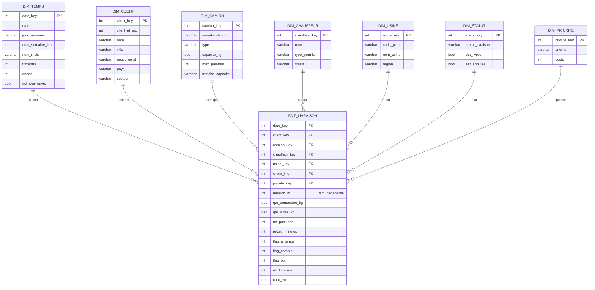
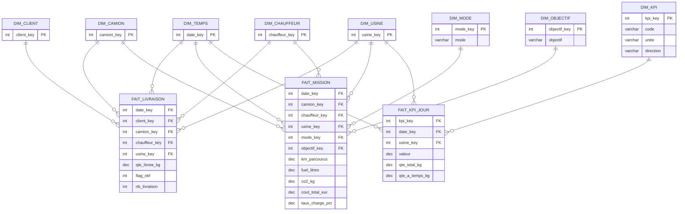

# Modèle dimensionnel (Business Intelligence) — Plateforme CofICab OptiRoute

> **Composante décisionnelle — version « soutenance / jury »**
> Méthode : modélisation **dimensionnelle de Kimball** (schéma en **étoile**,
> généralisé en **constellation de faits** à dimensions conformes).
> Objectif : entrepôt analytique (OLAP) alimentant les KPI logistiques
> (OTIF, OTD, taux de charge, consommation L/T·km, CO₂, coût/position).
> Source OLTP : modèle relationnel `docs/MODELE_ENTITE_RELATION.md`.
> Date : 2026-06-15.

---

## 1. Démarche & positionnement OLTP ↔ OLAP

| | OLTP (production) | OLAP (décisionnel — ce document) |
|---|---|---|
| But | Exécuter le transport | Analyser la performance |
| Modèle | Relationnel normalisé (3FN) | **Dimensionnel** (étoile, dénormalisé) |
| Opérations | INSERT/UPDATE unitaires | Agrégations, drill-down, slice & dice |
| Tables | `demandes_local`, `plan_mission`, `mission_demande`, `livraison_preuve`… | **Faits** + **Dimensions** |
| Fraîcheur | Temps réel | Rafraîchi par lot (nightly ETL) |

Le décisionnel **dénormalise volontairement** (l'inverse du §9 du MCD) : on
privilégie la **vitesse de lecture analytique** et la simplicité des requêtes,
quitte à dupliquer des libellés dans les dimensions.

---

## 2. Choix du grain (pierre angulaire)

> *Règle de Kimball : « déclarer le grain avant les faits et les dimensions ».*

| Fait | **Grain** (1 ligne = …) | Justification |
|---|---|---|
| **FAIT_LIVRAISON** | **un arrêt de livraison** (≈ `mission_demande` résolu par l'ePOD) | grain le plus fin de la performance de service ⇒ OTIF/OTD calculables, puis agrégeables à tout niveau |
| **FAIT_MISSION** | **une mission / tournée** (`plan_mission`) | grain « véhicule-jour » ⇒ km, carburant, charge, CO₂, coût |
| **FAIT_KPI_JOUR** | **un KPI × jour × usine** (`kpi_journalier`) | agrégat pré-calculé (table d'agrégat / snapshot) pour les tableaux de bord instantanés |

Le grain fin (FAIT_LIVRAISON) garantit qu'aucun KPI futur n'est bloqué par une
agrégation prématurée : on peut toujours remonter, jamais redescendre.

---

## 3. Architecture — constellation à dimensions conformes

Trois faits partagent les **mêmes dimensions conformes** (DIM_TEMPS, DIM_USINE…),
ce qui permet de **comparer/combiner** les KPI service (livraison) et les KPI
ressources (mission) sur les mêmes axes. C'est un **schéma en constellation**
(galaxie) : plusieurs étoiles emboîtées.

```
        DIM_TEMPS      DIM_USINE        DIM_CLIENT
            \             |                /
             \            |               /
   DIM_CAMION — ( FAIT_LIVRAISON ) — DIM_PRIORITE
             /            |               \
            /             |                \
     DIM_CHAUFFEUR   DIM_STATUT        (mission_id dégénérée)
```

---

## 4. Tables de faits

### 4.1 FAIT_LIVRAISON — *grain : un arrêt livré*
| Mesure | Type | **Additivité** | Origine OLTP |
|---|---|---|---|
| qte_demandee_kg | DEC | additive | `demandes_local.quantite_kg` |
| qte_livree_kg | DEC | additive | `livraison_preuve.quantite_livree_kg` |
| nb_positions | INT | additive | `demandes_local.nombre_palettes` |
| retard_minutes | INT | additive (∑) | `mission_demande.eta_reelle − eta_prevue` |
| flag_a_temps | 0/1 | additive (compteur) | `livraison_preuve.on_time` / `livree_a_temps` |
| flag_complet | 0/1 | additive (compteur) | `qte_livree_kg ≥ qte_demandee_kg` |
| flag_otif | 0/1 | additive (compteur) | `flag_a_temps AND flag_complet` |
| nb_livraison | 1 | additive (compteur) | constante de comptage |
| cout_eur | DEC | additive | quote-part `plan_mission.cout_*` |

**Clés étrangères :** `#date_key, #client_key, #camion_key, #chauffeur_key,
#usine_key, #statut_key, #priorite_key` + **`mission_id`** (dimension *dégénérée*).

### 4.2 FAIT_MISSION — *grain : une tournée*
| Mesure | Type | **Additivité** | Origine OLTP |
|---|---|---|---|
| km_parcourus | DEC | additive | `plan_mission.km_parcourus` |
| km_a_vide | DEC | additive | `plan_mission.km_a_vide` |
| charge_kg | DEC | additive | `plan_mission.charge_kg` |
| charge_palettes | INT | additive | `plan_mission.charge_palettes` |
| fuel_litres | DEC | additive | `plan_mission.fuel_consomme_l` |
| co2_kg | DEC | additive | `fuel_litres × 2.68` (facteur diesel) |
| cout_total_eur | DEC | additive | Σ `plan_mission.cout_*` |
| nb_stops | INT | additive | nb d'arrêts de la mission |
| duree_min | INT | additive | `heure_retour − heure_sortie` |
| **taux_charge_pct** | DEC | **NON-additive** (ratio) | `plan_mission.load_eff_pct` |

**Clés étrangères :** `#date_key, #camion_key, #chauffeur_key, #usine_key,
#mode_key, #objectif_key`.

### 4.3 FAIT_KPI_JOUR — *grain : KPI × jour × usine* (table d'agrégat)
Mesures non-additives **pré-calculées** (`valeur`) + matériaux additifs
(`qte_total_kg, qte_livree_kg, qte_a_temps_kg, fuel_consomme_l, km_parcourus,
km_a_vide, nb_incidents, nb_missions, cout_total_eur`).
**Clés :** `#kpi_key, #date_key, #usine_key`. Source : `kpi_journalier` (déjà
peuplée par le job `kpi_jobs.run_daily`).

---

## 5. Dimensions (attributs + hiérarchies)

| Dimension | Clé technique | Attributs | Hiérarchie (drill-down) | SCD |
|---|---|---|---|---|
| **DIM_TEMPS** | date_key (AAAAMMJJ) | date, jour, jour_semaine, num_semaine_iso, mois, nom_mois, trimestre, annee, est_jour_ouvre, est_ferie | Année ▸ Trimestre ▸ Mois ▸ Semaine ▸ Jour | fixe |
| **DIM_CLIENT** | client_key | client_id_src, nom, ville, gouvernorat, pays, secteur, latitude, longitude | Pays ▸ Gouvernorat ▸ Ville ▸ Client | **Type 2** |
| **DIM_CAMION** | camion_key | immatriculation, type, capacite_kg, max_palettes, capacite_m3, tranche_capacite | Type ▸ Camion | **Type 2** |
| **DIM_CHAUFFEUR** | chauffeur_key | nom, type_permis, statut | — | Type 1 |
| **DIM_USINE** | usine_key | code_plant, nom_usine, region | Région ▸ Usine | Type 1 |
| **DIM_STATUT** | statut_key | statut_livraison, est_livree, est_annulee | — | Type 1 |
| **DIM_PRIORITE** | priorite_key | priorite, poids | — | Type 1 |
| **DIM_MODE** | mode_key | mode (NORMAL / PREMIUM) | — | Type 1 |
| **DIM_OBJECTIF** | objectif_key | objectif (green / balanced / fast), libelle | — | Type 1 |

> **DIM_OBJECTIF** est le levier décisionnel propre au projet : il dimensionne
> les missions selon le **mode d'optimisation** (arbitrage coût/CO₂ ↔ délai),
> permettant l'analyse *what-if* « vert vs rapide » sur les mêmes axes.

> **SCD Type 2** (Slowly Changing Dimension) pour CLIENT et CAMION : on **historise**
> les changements (capacité d'un camion, déménagement d'un client) avec
> `date_debut_validite / date_fin_validite / version_courante`, afin qu'un KPI
> passé reflète la réalité de l'époque.

---

## 6. Dimension Temps (détail)

Dimension **incontournable** et toujours dénormalisée (jamais une simple `DATE`)
pour permettre les filtres métier (semaine ISO, jour ouvré, férié) sans calcul :

```
DIM_TEMPS(
  date_key AAAAMMJJ,  date,  jour (1-31),  jour_semaine ('Lundi'…),
  num_semaine_iso,  mois (1-12),  nom_mois,  trimestre (T1-T4),
  annee,  est_jour_ouvre (bool),  est_ferie (bool)
)
```

---

## 7. Diagramme — Étoile principale (FAIT_LIVRAISON)



## 7 bis. Diagramme — Constellation (faits + dimensions conformes)



---

## 8. Calcul des KPI à partir des mesures additives

> **Règle d'or BI :** un ratio n'est JAMAIS stocké comme moyenne agrégée ; on
> stocke ses **numérateur et dénominateur additifs** et on calcule le ratio
> *au moment de la requête* (« non-additivité des ratios »).

| KPI | Formule (sur FAIT_*) | Source mesures |
|---|---|---|
| **OTD** (On-Time Delivery) | `Σ flag_a_temps / Σ nb_livraison` | FAIT_LIVRAISON |
| **OTIF** (On-Time In-Full) | `Σ flag_otif / Σ nb_livraison` | FAIT_LIVRAISON |
| **Taux de service kg** | `Σ qte_livree_kg / Σ qte_demandee_kg` | FAIT_LIVRAISON |
| **Taux de charge moyen** | `Σ charge_kg / Σ capacite_kg(camion)` | FAIT_MISSION × DIM_CAMION |
| **Conso. spécifique (L/T·km)** | `Σ fuel_litres / (Σ (charge_kg/1000) × Σ km_parcourus)` | FAIT_MISSION |
| **Empreinte CO₂** | `Σ co2_kg` (= `Σ fuel_litres × 2,68`) | FAIT_MISSION |
| **CO₂ par position** | `Σ co2_kg / Σ nb_positions` | constellation |
| **Coût par position** | `Σ cout_total_eur / Σ nb_positions` | constellation |
| **Taux d'incidents** | `Σ nb_incidents / Σ nb_missions` | FAIT_KPI_JOUR |

---

## 9. Étoile vs flocon (justification)

| Critère | Étoile (retenu) | Flocon |
|---|---|---|
| Dimensions | dénormalisées (1 table/dim) | normalisées (sous-tables) |
| Jointures | peu, rapides | nombreuses |
| Lisibilité métier | forte | faible |
| Volume disque | + | − |

**Choix : schéma en étoile.** Les volumes (flotte de ~7 camions, quelques
centaines de livraisons/semaine) sont faibles ; la priorité est la **rapidité
des restitutions** et la **clarté pour le pilote logistique**. Le léger surcoût
de stockage des dimensions dénormalisées est négligeable. *(Seule DIM_CLIENT
pourrait être « floconnée » sur la hiérarchie géographique si besoin de
référentiel partagé — non retenu ici.)*

---

## 10. Alimentation (ETL) — du transactionnel à l'entrepôt

```
 Classeur Excel ──(Excel Watcher / ingestion)──▶  OLTP (demandes_local, livraisons…)
        │                                               │
        │                              exécution + ePOD  ▼
        │                          (plan_mission, mission_demande, livraison_preuve)
        ▼                                               │
   STAGING  ◀───────── Extract (lecture incrémentale) ──┘
        │
        │  Transform : nettoyage, résolution des clés substituts (lookups SCD),
        │              calcul des flags (a_temps, complet, otif), conversion CO₂
        ▼
   ENTREPÔT (DIM_* + FAIT_*)  ──agrégation nightly──▶  FAIT_KPI_JOUR
                                   (job kpi_jobs.run_daily / run_monthly)
```

| Cible entrepôt | Source(s) OLTP | Transformation clé |
|---|---|---|
| DIM_CLIENT | `clients` | lookup SCD2, normalisation ville/gouvernorat |
| DIM_CAMION | `camions` | tranche_capacite, SCD2 |
| DIM_TEMPS | générée | calendrier (jours ouvrés/fériés TN) |
| FAIT_LIVRAISON | `mission_demande` ⋈ `demandes_local` ⋈ `livraison_preuve` | flags OTIF/OTD, retard, quote-part coût |
| FAIT_MISSION | `plan_mission` | CO₂ = fuel × 2,68 ; durée |
| FAIT_KPI_JOUR | `kpi_journalier` (existant) | reprise directe (agrégat déjà calculé) |

> Les tables `kpi_definition / kpi_journalier / kpi_mensuel` du système **sont
> déjà la préfiguration de la couche agrégat** : le modèle en étoile ci-dessus
> en est la généralisation dimensionnelle (ajout des dimensions conformes et du
> grain fin FAIT_LIVRAISON).

---

## 11. Restitutions cibles (illustration des axes)

- **OTIF/OTD** par *mois × usine × client* (drill-down Année▸Mois▸Jour) — DIM_TEMPS, DIM_USINE, DIM_CLIENT
- **L/T·km & CO₂** par *type de camion × mode d'optimisation* — DIM_CAMION, DIM_OBJECTIF
- **Taux de charge** par *chauffeur × semaine* — DIM_CHAUFFEUR, DIM_TEMPS
- **Coût/position** par *priorité* (urgent vs normal) — DIM_PRIORITE
