# CofICab Platform Use-Case Diagram

The diagram is simplified to keep the UML intent clear:

- real human actors are on the left
- external systems and automated helper actors are on the right
- `include` is used for mandatory sub-flows
- `extend` is used for optional or exceptional behavior
- actor inheritance is used where roles inherit permissions

```mermaid
flowchart LR
    %% Human actors - left side
    viewer["Viewer"]
    planner["Planner / Dispatcher"]
    admin["Administrator"]
    driver["Driver"]

    planner -.->|inherits| viewer
    admin -.->|inherits| planner

    %% System boundary - center
    subgraph platform["CofICab OptiRoute Platform"]
        direction TB

        subgraph access["Access"]
            UC_Login(("Authenticate"))
            UC_AdminUsers(("Manage Users"))
        end

        subgraph data["Data Ingestion"]
            UC_Upload(("Upload Planning Workbook"))
            UC_TriggerIngestion(("Trigger Ingestion"))
            UC_Import(("Validate And Import Data"))
            UC_ViewLogs(("View Ingestion Logs"))
        end

        subgraph planning["Planning"]
            UC_GeneratePlan(("Generate Daily Plan"))
            UC_Optimize(("Optimize Routes"))
            UC_ValidatePlan(("Validate Plan"))
            UC_EditPlan(("Edit Plan"))
            UC_Export(("Export Plan"))
            UC_Explain(("Explain Plan Decision"))
            UC_Replan(("Replan After Disruption"))
            UC_Split(("Manage Oversized Delivery Split"))
        end

        subgraph execution["Execution"]
            UC_Dispatch(("Dispatch Mission Briefs"))
            UC_ViewBrief(("View Mission Brief"))
            UC_StartMission(("Start Mission"))
            UC_ConfirmDelivery(("Confirm Delivery ePOD"))
            UC_ReportException(("Report Delivery Exception"))
            UC_Track(("Track Missions On Map"))
        end

        subgraph operations["Operations Monitoring"]
            UC_Dashboard(("View Dashboard"))
            UC_KPI(("View KPIs And Trends"))
            UC_Incidents(("Manage Incidents"))
            UC_Fleet(("View Fleet Drivers And Clients"))
            UC_UpdateTruck(("Update Truck Status"))
            UC_Agents(("View Agent Status"))
            UC_Copilot(("Ask OptiRoute Copilot"))
        end
    end

    %% Helper/external actors - right side
    watcher["Excel Watcher Agent"]
    scheduler["Scheduler Agent"]
    monitor["KPI Monitor Agent"]
    tracker["TFM Tracker Agent"]
    tfm["External TFM System"]
    llm["External LLM Provider"]

    %% Human actor links
    viewer --> UC_Login
    viewer --> UC_Dashboard
    viewer --> UC_KPI
    viewer --> UC_Track
    viewer --> UC_Fleet
    viewer --> UC_Agents
    viewer --> UC_Copilot

    planner --> UC_ViewLogs
    planner --> UC_GeneratePlan
    planner --> UC_ValidatePlan
    planner --> UC_EditPlan
    planner --> UC_Export
    planner --> UC_Dispatch
    planner --> UC_StartMission
    planner --> UC_ConfirmDelivery
    planner --> UC_ReportException
    planner --> UC_Incidents
    planner --> UC_UpdateTruck

    admin --> UC_AdminUsers
    admin --> UC_Upload

    driver --> UC_ViewBrief
    driver --> UC_StartMission
    driver --> UC_ConfirmDelivery
    driver --> UC_ReportException

    %% Helper/external actor links
    watcher --> UC_TriggerIngestion
    scheduler --> UC_GeneratePlan
    monitor --> UC_KPI
    tracker --> UC_Track
    tfm --> tracker
    llm --> UC_Copilot

    %% Include relationships - required behavior
    UC_Upload -.->|include| UC_TriggerIngestion
    UC_TriggerIngestion -.->|include| UC_Import
    UC_GeneratePlan -.->|include| UC_Optimize
    UC_Dispatch -.->|include| UC_ViewBrief
    UC_Dashboard -.->|include| UC_KPI
    UC_Dashboard -.->|include| UC_Track

    %% Extend relationships - optional or exceptional behavior
    UC_EditPlan -.->|extend| UC_ValidatePlan
    UC_Split -.->|extend| UC_EditPlan
    UC_Explain -.->|extend| UC_GeneratePlan
    UC_Replan -.->|extend| UC_GeneratePlan
    UC_ReportException -.->|extend| UC_ConfirmDelivery
```

## Source Traceability

- Frontend navigation and API calls: `frontend/components/layout/Sidebar.jsx`, `frontend/app/services/api.ts`
- Backend routes: `backend/app/main.py`, `backend/app/routes/*.py`
- Roles and permissions: `backend/app/routes/auth.py`, `backend/app/services/auth_service.py`
- Agents and external systems: `README.md`, `docs/AGENTS.md`
- Database states and logistics entities: `database/schema.sql`, `backend/app/models/*.py`
