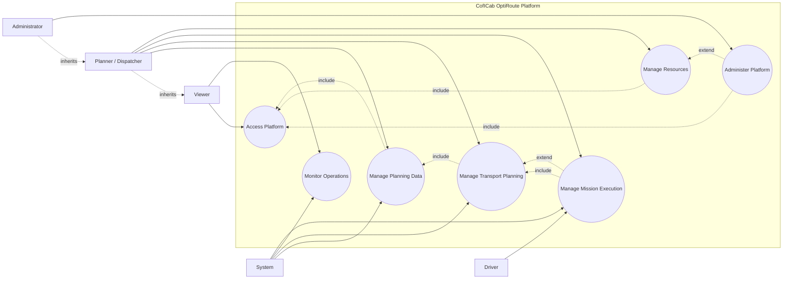

# CofICab Platform Global Use-Case Diagram

This is a global user-interaction view. Background automation such as watchdogs, schedulers, trackers, optimization jobs, KPI jobs, and notifications is grouped into one helper actor: **System**.

## Notes

- **Viewer** only observes platform information.
- **Planner / Dispatcher** manages daily operational work.
- **Administrator** inherits planner capabilities and adds administration.
- **Driver** interacts only with mission execution.
- **System** represents all automated/background helpers.
