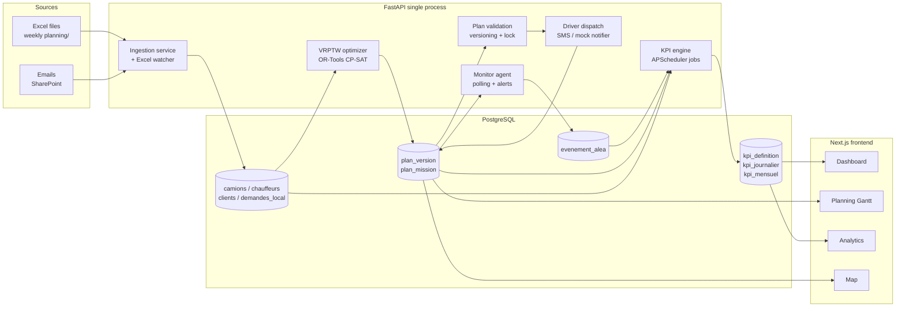

# 00 — Architecture Overview & Optimizations

## Current state (what exists)

```
coficab_platform/
├── backend/                   FastAPI app, partially wired
│   ├── app/
│   │   ├── main.py            8 routers mounted (metrics, tracking, ingestion,
│   │   │                      optimization, data, auth, tasks, planning, agents)

│   │   ├── database.py        SQLAlchemy engine + pool, resilient to no-DB
│   │   ├── models/            livraison, ingestion_log, planning_*, transport
│   │   ├── routes/            one router per concern
│   │   └── services/          excel_watcher, ingestion_service, planning_service,
│   │                          vrptw_complete_optimizer, auth_service
├── frontend/                  Next.js 14 (app router), UI complete on mock data
│   ├── app/                   12 pages (dashboard, planning, daily-planning, …)
│   ├── components/            cards/StatCard, charts/BarChart, layout/Sidebar
│   └── data/                  mock JSON used by the pages today
├── agents/                    4 separate Docker services (collector, optimizer,
│                              notifier, monitor) — each with its own main.py
├── orchestrator/              4th moving part
├── database/schema.sql        Generic, does NOT match the Coficab ERD in the spec
└── docs/                      ARCHITECTURE, AGENTS, API, REQUIREMENTS
```

## Architecture optimizations (no UI change, simpler runtime)

### 1. Collapse the 4 agent containers into APScheduler jobs inside the backend

**Why:** Four extra containers + an orchestrator means 5 separate Python processes communicating via the database anyway. Same outcome, fewer moving parts, one deploy.

**How:** Keep the four "agent" concepts as logical modules under `backend/app/agents/`, but run them as APScheduler jobs in the FastAPI lifespan. No code is lost — the existing `agents/*/main.py` becomes `backend/app/agents/*.py`.

```python
# backend/app/agents/scheduler.py
from apscheduler.schedulers.background import BackgroundScheduler
from app.agents import collector, optimizer, notifier, monitor

def start_scheduler():
    sched = BackgroundScheduler()
    sched.add_job(collector.run, "interval", minutes=15, id="collector")
    sched.add_job(optimizer.run, "cron", hour=6, minute=0, id="optimizer-daily")
    sched.add_job(monitor.run,   "interval", seconds=30, id="monitor")
    sched.add_job(notifier.flush, "interval", seconds=10, id="notifier")
    sched.start()
    return sched
```

Wire it in `main.py` `lifespan()` next to the existing `excel_watcher`.

**Removed:** `agents/agent*/Dockerfile`, `agents/agent*/requirements.txt`, `orchestrator/`. Keep their `main.py` logic, moved into the backend.

**Kept identical:** the docker-compose surface stays single-service for the API. PostgreSQL stays its own container.

### 2. Drop `database_new.py` / `data_new.py` duplicates

Two parallel modules exist (`database.py` + `database_new.py`, `data.py` + `data_new.py`). Pick one set, delete the other. The new schema (skill 02) is the only one going forward — wire it to `database.py`. Same for the route.

### 3. Replace generic `schema.sql` with the Coficab ERD

The current schema has `users / agents / events / tasks / alerts / planning_versions / planning_change_logs`. The spec image shows the real domain tables: `camions / chauffeurs / clients / demandes_local / plan_mission / plan_version / mission_demande / evenement_alea / kpi_definition / kpi_journalier / kpi_mensuel`. See skill 02 for the full DDL.

### 4. Frontend: mock data → API, layout untouched

Each page currently imports from `frontend/data/dashboardData.ts`. The work is a 1:1 swap: `import { kpiData } from '@/data/dashboardData'` becomes `const { data: kpiData } = useKpi()` where `useKpi` is a SWR hook against `/api/metrics/kpi`. **No JSX changes, no Tailwind class changes, no color changes.** See skill 09 for the wrapper pattern.

---

## Final architecture (target)



---

## Layer responsibilities

| Layer | What it does | Owns | Reads from |
|---|---|---|---|
| Ingestion | Watches Excel folder + email, parses, writes `demandes_local` | `demandes_local`, `clients` (upserts) | filesystem, IMAP |
| Optimizer | OR-Tools VRPTW, produces a candidate `plan_version` (DRAFT) | `plan_version`, `plan_mission` (DRAFT only) | `demandes_local`, `camions`, `chauffeurs` |
| Validation | Versioning, locking, impact preview API | `plan_version.statut_plan_enum` | candidate plan, current KPI snapshot |
| Dispatch | Sends mission brief to assigned drivers | (none — writes notification log) | validated `plan_mission` rows |
| Monitor | Polls in-flight missions, detects SLA breach risk | `evenement_alea` (when breach happens) | `plan_mission.statut`, ETAs |
| KPI engine | Aggregates daily/monthly snapshots | `kpi_journalier`, `kpi_mensuel` | every other table |
| Frontend | Reads from REST API, renders existing UI | (nothing — pure consumer) | every `/api/*` endpoint |

---

## Folder layout after applying these optimizations

```
coficab_platform/
├── backend/
│   ├── app/
│   │   ├── main.py
│   │   ├── database.py         (database_new.py deleted)
│   │   ├── models/
│   │   │   ├── camion.py
│   │   │   ├── chauffeur.py
│   │   │   ├── client.py
│   │   │   ├── demande.py
│   │   │   ├── plan.py         (plan_version + plan_mission + mission_demande)
│   │   │   ├── evenement.py
│   │   │   └── kpi.py          (definition + journalier + mensuel)
│   │   ├── routes/
│   │   │   ├── auth.py
│   │   │   ├── metrics.py      (KPI endpoints — see skill 09)
│   │   │   ├── ingestion.py
│   │   │   ├── optimization.py
│   │   │   ├── planning.py     (replaces planning_governance + tasks)
│   │   │   ├── tracking.py
│   │   │   ├── incidents.py    (NEW — evenement_alea CRUD)
│   │   │   └── fleet.py        (NEW — camions + chauffeurs + clients)
│   │   ├── services/
│   │   │   ├── ingestion_service.py
│   │   │   ├── excel_watcher.py
│   │   │   ├── vrptw_optimizer.py     (renamed from vrptw_complete_optimizer)
│   │   │   ├── planning_service.py
│   │   │   ├── kpi_service.py         (NEW — implements every R4/R5 formula)
│   │   │   ├── dispatch_service.py    (NEW — notification orchestration)
│   │   │   └── auth_service.py
│   │   └── agents/             (NEW — folded from /agents/)
│   │       ├── scheduler.py
│   │       ├── collector.py
│   │       ├── optimizer.py
│   │       ├── notifier.py
│   │       └── monitor.py
│   ├── seed.py
│   └── tests/
├── frontend/                   (untouched visually)
│   ├── app/                    (pages keep same JSX, swap data sources)
│   ├── components/
│   ├── lib/api.ts              (NEW — typed fetch wrappers)
│   └── hooks/useKpi.ts         (NEW — SWR hooks)
├── database/
│   ├── schema.sql              (rewritten per skill 02)
│   ├── seed_kpi_definitions.sql (KPI catalog: R4-06, R4-02, R4-13, …)
│   └── seed_demo.sql           (camions, chauffeurs, clients for local dev)
└── skills/                     (this folder)
```

---

## What gets deleted (with confidence)

- `coficab_platform/orchestrator/` — replaced by APScheduler.
- `coficab_platform/agents/agent*/Dockerfile` and `requirements.txt` — agents now share the backend env.
- `coficab_platform/backend/app/database_new.py`, `routes/data_new.py` — duplicates.
- `coficab_platform/backend/app/services/vrptw_optimizer_archived.py` — clearly named as archived.
- The exotic stray files in the project root (literal filenames like `(`, `{`, `setPeriod(option)}`, `0`, `80`, `2.8.2`, etc.) — these were created by an earlier bad shell command and serve no purpose. Verify with `git status` they aren't tracked, then delete.

**Before deleting anything**, run a `git status` (or back up). The exotic root files in particular need a quick check that they aren't notes the human left.

---

## What does NOT change

- Every `.jsx` file under `frontend/app/` and `frontend/components/`.
- `frontend/tailwind.config.js`, `globals.css`, the purple gradient `from-[#7c3aed] via-[#6d28d9] to-[#5b21b6]`.
- The Lucide icon set already in use (`Truck`, `Route`, `AlertTriangle`, `BarChart3`, etc.).
- The Recharts component choices (`AreaChart`, `BarChart`, `PieChart`, `ComposedChart`).
- Card backgrounds (`bg-white`), background canvas (`bg-[#f8f7f3]`), text colors (`text-[#1a1a2e]`, `text-[#6b6b7b]`).

See [`reference/ui-conventions.md`](reference/ui-conventions.md) for the full do-not-touch list.
