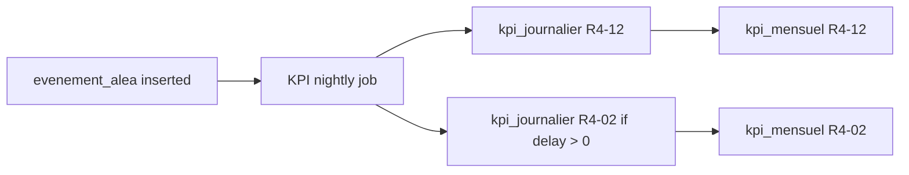

# 07 — Incident & Aléa Tracking

> Goal: capture every disruption (breakdowns, traffic, refused deliveries, client complaints) into `evenement_alea`, link it to the affected mission/demande, and feed it back into the KPIs.

## Current implementation status

Audited and implemented on 2026-06-02:
- ✅ `backend/app/services/incident_service.py` logs and resolves incidents through a dedicated service.
- ✅ `/api/incidents`, `/api/incidents/{id}`, `/api/incidents/{id}/resolve`, and `/api/incidents/stats` are wired.
- ✅ `PANNE_VEHICULE` cancels the linked mission and `CLIENT_INDISPONIBLE` cancels the linked demande.
- ✅ `CLIENT_COMPLAINT` feeds R4-12 through the KPI monthly snapshot job.
- ✅ `backend/tests/test_incidents.py` verifies service side effects, API list/stats/resolve, and R4-12 feedback.
- ⬜ Frontend incident feed wiring remains pending under skill 09/10.

## KPI anchor
- **R4-12 Customer Logistics Incidents / MKm sold** — counts `type='CLIENT_COMPLAINT'`.
- **R4-02 OTD / R4-06 OTIF** — `impact_delai_min` directly worsens these.
- **R4-03 Premium Freight occurrences** — many breakdowns mid-route trigger premium replacement transport.

Without this table, R4-12 cannot be computed. **This is non-optional.**

---

## Incident taxonomy (matches `evenement_type_enum` in skill 02)

| Type | When | Source | Impact field |
|---|---|---|---|
| `PANNE_VEHICULE` | Truck breakdown during mission | Driver via mobile/phone → planner | `impact_delai_min` (until replacement arrives) |
| `RETARD_TRAFIC` | Road closure, jam | Driver, automatic from GPS later | `impact_delai_min` |
| `CLIENT_INDISPONIBLE` | Delivery refused / nobody at site | Driver | `impact_delai_min` (reschedule cost) |
| `DEPASSEMENT_CAPACITE` | Load > truck max | Detected at loading dock | typically 0 (planning issue) |
| `DEMANDE_LAST_MINUTE` | New demande after plan validation | Planner | 0 (informational), triggers re-plan |
| `CLIENT_COMPLAINT` | Customer logged a logistics complaint | Customer service → planner | 0 (feeds R4-12) |

---

## Service: `backend/app/services/incident_service.py`

```python
from datetime import datetime
from sqlalchemy.orm import Session
from app.models.evenement import EvenementAlea, EvenementType
from app.models.plan import PlanMission, StatutMission
from app.models.demande import DemandeLocal, StatutDemande

class IncidentService:
    def __init__(self, db: Session):
        self.db = db

    def log(self, *, type: EvenementType, description: str,
            mission_id: int | None = None, demande_id: int | None = None,
            impact_delai_min: int = 0, cause: str | None = None) -> EvenementAlea:
        plan_version_id = None
        if mission_id is not None:
            m = self.db.get(PlanMission, mission_id)
            plan_version_id = m.plan_version_id if m else None

        ev = EvenementAlea(
            plan_version_id=plan_version_id,
            mission_id=mission_id,
            demande_id=demande_id,
            type=type,
            description=description,
            impact_delai_min=impact_delai_min,
            cause=cause,
            date_evenement=datetime.utcnow(),
        )
        self.db.add(ev)

        # Side effects on linked rows
        self._apply_side_effects(type, mission_id, demande_id, impact_delai_min)

        self.db.commit()
        return ev

    def resolve(self, incident_id: int, note: str | None = None):
        ev = self.db.get(EvenementAlea, incident_id)
        ev.resolu = True
        ev.date_resolution = datetime.utcnow()
        if note:
            ev.description = (ev.description or "") + f"\nRESOLU: {note}"
        self.db.commit()
        return ev

    def _apply_side_effects(self, type, mission_id, demande_id, delay_min):
        if type == EvenementType.PANNE_VEHICULE and mission_id:
            m = self.db.get(PlanMission, mission_id)
            m.statut = StatutMission.ANNULEE  # planner will re-plan
        elif type == EvenementType.CLIENT_INDISPONIBLE and demande_id:
            d = self.db.get(DemandeLocal, demande_id)
            d.statut = StatutDemande.ANNULEE
        # CLIENT_COMPLAINT has no side effect on operations,
        # but it's counted by KpiService.compute_customer_incidents.
```

---

## API endpoints

```
POST /api/incidents                       { type, description, mission_id?, demande_id?, impact_delai_min?, cause? }
POST /api/incidents/{id}/resolve          { note }
GET  /api/incidents?from=&to=&type=       paginated list
GET  /api/incidents/{id}                  detail + linked mission + demande
GET  /api/incidents/stats?month=YYYY-MM   counts by type + sum of delays
```

Use the existing `frontend/components/JustificationModal.jsx` for the form. The `cause` dropdown should be a fixed list per type (driver, weather, vehicle, traffic, client, other).

---

## Frontend wiring

Page: `frontend/app/ai-monitor/page.jsx` is a natural home for the incident feed. The dashboard's `alerts` mock list also surfaces incidents (sidebar in `frontend/app/dashboard/page.jsx`, look for the `Bell` icon block) — bind it to `GET /api/incidents?resolu=false&limit=5`.

No layout changes. Same `StatusBadge` (`frontend/components/shared/StatusBadge.jsx`) with severity:
- `severity='error'`   → red — PANNE_VEHICULE, CLIENT_COMPLAINT
- `severity='warning'` → yellow — RETARD_TRAFIC, CLIENT_INDISPONIBLE, DEPASSEMENT_CAPACITE
- `severity='info'`    → blue — DEMANDE_LAST_MINUTE

---

## Feedback loop into KPIs



The KPI job (skill 08) reads `evenement_alea` for the period, computes counts, writes snapshots. **Don't re-compute KPIs synchronously on incident insert** — the daily job is fine.

---

## Auto-detection (optional, v2)

The monitor agent (skill 10) polls in-flight missions every 30s. When ETA slips by more than the SLA tolerance, it auto-creates a `RETARD_TRAFIC` incident with the projected delay. v1 keeps it manual; v2 wires the monitor.

---

## Anti-patterns

- ❌ Logging incidents inside route handlers — always go through `IncidentService`.
- ❌ Free-text `type` field — use the enum to keep KPI counting reliable.
- ❌ Forgetting to re-link to `plan_version_id` — without it, audit and historical incident replay break.
- ❌ Auto-resolving incidents — leave resolution to the planner so the dashboard always shows what's open.

---

## Verification

1. POST `/api/incidents` with `type=CLIENT_COMPLAINT, description='Late delivery TANGITEX'`.
2. Confirm `evenement_alea` row exists.
3. Run the KPI job manually: `python -m app.agents.kpi_recompute --month 2026-05`.
4. `SELECT * FROM kpi_mensuel WHERE kpi_def_id=(SELECT id FROM kpi_definition WHERE code='R4-12')` → value increased.
5. Dashboard cell for R4-12 reflects the new value and color.
