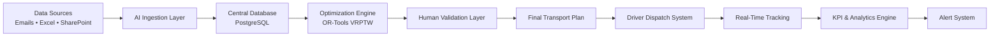
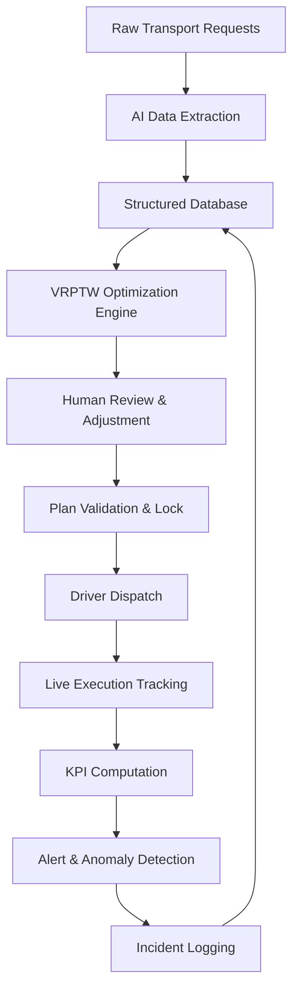

# 🚚 AI-Augmented Transport Planning & Logistics Intelligence Platform
### Coficab Group — Intelligent Decision Support System

---

## 1. Executive Summary

This project delivers a next-generation intelligent logistics platform for Coficab Group, designed to transform traditional transport operations into a fully data-driven, AI-assisted, and optimized decision system.

The platform replaces fragmented tools (Excel, email, manual planning) with a unified system combining:

- AI-driven data extraction from unstructured sources (emails, Excel, SharePoint)
- Vehicle Routing Problem with Time Windows (VRPTW) solver using Google OR-Tools
- Real-time KPI monitoring & operational dashboards
- Human-in-the-loop planning validation with impact simulation
- Dynamic fleet & delivery orchestration
- Automated driver dispatch and notification system

The objective is to reduce operational inefficiencies while improving delivery reliability, cost efficiency, and decision traceability across Coficab's transport network.

---

## 2. Industrial Context

Coficab operates in a high-pressure automotive supply chain where:

- Deliveries follow strict Just-In-Time (JIT) constraints imposed by OEM clients
- Delays directly impact downstream production lines, triggering financial penalties
- Transport planning is currently managed manually by a small operations team
- Operational data is fragmented across Excel files, emails, and SharePoint folders

### Key Issues Identified (Pre-System)

| Issue | Impact |
|---|---|
| No centralized planning system | Decisions made on incomplete data |
| Manual Excel-based workflows | Error-prone, non-traceable |
| Reactive incident handling | Delays discovered after they occur |
| No truck utilization tracking | Fleet underused or overloaded |
| Inconsistent KPI calculation | No reliable performance baseline |

---

## 3. Project Objectives

The platform is designed to:

- Centralize all logistics data into a unified, auditable architecture
- Automate daily transport planning using constraint-based AI optimization
- Improve truck utilization via intelligent delivery grouping (groupage)
- Provide real-time KPI dashboards accessible to operations managers
- Enable human validation and override of AI-generated plans
- Track operational incidents and build a historical disruption database

---

## 4. System Architecture

### High-Level Architecture



### Architectural Principles

- **Separation of concerns**: Each layer (ingestion, optimization, validation, dispatch) is independently deployable
- **Auditability**: Every planning decision is versioned and traceable
- **Human oversight**: AI generates plans; humans approve them — the system never dispatches without explicit validation
- **Stateless optimization**: The VRPTW solver operates on snapshots, enabling re-optimization on demand

---

## 5. Core Modules

### 5.1 KPI Intelligence Dashboard

Real-time operational visibility across key logistics metrics:

| KPI | Definition |
|---|---|
| On-Time Delivery (OTD) | % of deliveries arriving within the agreed time window |
| On-Time In-Full (OTIF) | % of deliveries complete in quantity and on time |
| Truck Utilization Rate | Actual load / capacity, per trip and per day |
| Cost per Shipment | Total transport cost divided by number of delivery stops |
| Delay Risk Index | Composite score based on weather, traffic, and historical incidents |
| Incident Frequency | Number of disruption events per week/month |

KPIs are computed at daily, weekly, and monthly horizons to support both operational and managerial decision-making.

---

### 5.2 Deliveries Control Center

A live operational board displaying:

- All active transport missions for the current day
- Delivery groupings per assigned truck
- Real-time status per shipment (Planned / In Transit / Delivered / Delayed)
- Priority flags and SLA breach alerts

---

### 5.3 Fleet & Driver Management

#### Trucks

| Status | Description |
|---|---|
| Available | Ready for assignment |
| In Route | Currently executing a mission |
| Maintenance | Scheduled downtime |
| Breakdown | Unplanned unavailability |

Truck availability is updated dynamically. Capacity constraints (volume in pallets, weight in kg) are enforced at the assignment level.

#### Drivers

- Each driver has a default truck and a defined shift window
- Manual reassignment is available to the transport manager
- Driver availability is considered as a hard constraint during optimization

---

### 5.4 AI Planning Workspace (Core Innovation)

An interactive Gantt-based planning interface where:

- **X-axis**: Time (hourly slots across the workday)
- **Y-axis**: Trucks (one row per available vehicle)
- **Blocks**: Multi-stop delivery missions with visual capacity indicators

Each mission block displays:

- Grouped deliveries (groupage) with stop sequence
- Capacity utilization % (color-coded: green / orange / red)
- Estimated total travel time
- Time window compliance status per stop

The planner can drag, resize, or reassign blocks — every modification triggers an immediate impact analysis (see §5.5).

---

### 5.5 Human-in-the-Loop AI System

The system follows an **AI-propose, human-approve** model:

1. The optimization engine generates a candidate plan
2. The transport manager reviews it in the Gantt interface
3. Any manual modification instantly triggers:
   - **Cost variation estimate** (distance delta × cost/km)
   - **Delay probability recalculation** (updated per modified stop)
   - **Truck utilization impact** (new load % after change)
   - **Time window feasibility check** (will modified stop still respect client SLA?)

This ensures decisions remain explainable and traceable — every accepted plan is stored with its modification history.

---

### 5.6 Validation & Execution Workflow

```
1. Optimization engine generates candidate plan
2. Transport manager reviews in Gantt interface
3. Manual adjustments allowed (with real-time impact display)
4. Manager explicitly validates the plan
5. System locks the plan version (no further editing)
6. Driver notifications dispatched automatically
```

Validated plans are immutable. Any subsequent change requires creating a new plan version, preserving the full audit trail.

---

### 5.7 Driver Notification System

Upon plan validation, each assigned driver automatically receives a structured mission brief containing:

- Ordered stop sequence with addresses
- Scheduled arrival time window per stop
- Client contact information
- Special handling instructions (if any)
- Route assignment identifier

Notifications are dispatched via SMS or a configured messaging API.

---

### 5.8 Incident & Delay Management

All operational disruptions are logged and classified:

| Incident Type | Example |
|---|---|
| Vehicle breakdown | Truck unavailable mid-route |
| Traffic delay | Road closure causing SLA breach |
| Client unavailability | Delivery refused or rescheduled |
| Capacity overflow | Load exceeds truck limit |
| Last-minute request | New delivery added after plan validation |

Each logged incident includes: cause category, timestamp, estimated delay in minutes, impacted deliveries, and downstream KPI effect. This data feeds the historical disruption database used for future risk scoring.

---

## 6. Optimization Engine (VRPTW)

The core scheduling problem is formulated as a **Vehicle Routing Problem with Time Windows (VRPTW)** and solved using **Google OR-Tools** (CP-SAT solver).

### Problem Formulation

**Decision variables:**
- Assignment of delivery requests to trucks
- Ordering of stops within each truck's route
- Departure time per stop

**Hard constraints:**
- Vehicle capacity (pallets / kg) must not be exceeded
- Each delivery must be served within its client-defined time window
- Each truck has a fixed start location (depot) and return constraint
- Driver shift hours are enforced

**Soft constraints (penalized in objective):**
- Prefer grouping geographically close deliveries
- Prefer balanced load distribution across the fleet

**Objective function:**

Minimize:
```
α × Total_Distance + β × Total_Delay_Penalty + γ × Underutilization_Cost
```

Where α, β, γ are configurable business weights, allowing the operations team to prioritize cost vs. service level vs. fleet efficiency.

### Solution Strategy

- Initial solution: **Clarke-Wright Savings Algorithm** (fast heuristic for warm start)
- Improvement phase: **OR-Tools Local Search** (LNS — Large Neighborhood Search)
- Time limit: configurable per planning horizon (default: 60 seconds for daily plan)

---

## 7. Multi-Agent System

The platform uses a lightweight multi-agent architecture where each agent is an independent service with a defined input/output contract.

| Agent | Role | Trigger |
|---|---|---|
| **Ingestion Agent** | Parses emails and Excel files; extracts structured delivery requests using LLM-based extraction + validation rules | On schedule (e.g., every morning at 06:00) or on-demand |
| **Planning Agent** | Calls the VRPTW solver with current fleet state and delivery requests; returns candidate plan | On user request or scheduled daily |
| **Monitoring Agent** | Polls execution status; updates KPIs in real time; detects SLA breach risk | Continuous (polling interval: configurable) |
| **Alert Agent** | Evaluates thresholds on KPI metrics; triggers notifications to operations managers | Event-driven (on anomaly detection) |

**Agent interaction flow:**

```
Ingestion Agent → [Database] → Planning Agent → [Candidate Plan] → Human Validation
                                                                          ↓
Monitoring Agent ← [Execution Data] ← Driver Dispatch ← [Validated Plan]
        ↓
   Alert Agent → [Notifications]
```

Agents communicate via the central database (event-sourcing pattern), avoiding tight coupling between services.

---

## 8. Database Design Overview

### Core Entities

| Entity | Key Attributes |
|---|---|
| Trucks | id, capacity_kg, capacity_pallets, status, default_driver |
| Drivers | id, name, shift_start, shift_end, assigned_truck |
| Clients | id, name, address, coordinates, time_window_open, time_window_close |
| Delivery Requests | id, client_id, weight, volume, requested_date, priority |
| Missions | id, truck_id, driver_id, plan_version_id, stops (ordered list) |
| Plan Versions | id, created_at, validated_at, validated_by, status |
| KPI Snapshots | id, metric_name, value, computed_at, horizon (daily/weekly/monthly) |
| Alerts | id, type, severity, triggered_at, resolved_at |
| Incident Logs | id, mission_id, type, cause, delay_minutes, impacted_deliveries |

### Key Design Decisions

- **Plan versioning**: Every planning iteration is stored as a separate version, enabling full rollback and audit
- **Immutable validated plans**: Once validated, a plan version is write-locked
- **KPI time series**: Snapshots stored at multiple granularities for trend analysis
- **Incident linkage**: Every incident is traceable to a specific mission and plan version

---

## 9. KPI & Business Intelligence Layer

KPIs are computed and stored across multiple time horizons:

| Horizon | Use Case |
|---|---|
| Daily | Operational monitoring — is today's plan on track? |
| Weekly | Short-term trend — are we improving or regressing? |
| Monthly | Management reporting — aggregate performance |
| Year-to-date | Strategic review — annual benchmarking |

The KPI engine runs as a scheduled job (APScheduler), aggregating raw execution data into normalized metrics stored in the KPI Snapshots table.

**Planned future enhancement:** ML-based KPI forecasting to predict next-week OTD and delay risk before the planning cycle begins.

---

## 10. Technology Stack

| Layer | Technology | Justification |
|---|---|---|
| Backend API | FastAPI (Python) | Async support, automatic OpenAPI docs, strong typing |
| Optimization | Google OR-Tools (CP-SAT) | Industry-standard VRPTW solver, open source, well-documented |
| Database | PostgreSQL | ACID compliance, JSON support for flexible stop sequences |
| Frontend | React.js | Component-based UI, strong ecosystem for Gantt/dashboard rendering |
| Visualization | Chart.js / Plotly | KPI dashboards and route visualization |
| Scheduling | APScheduler | Lightweight job scheduler for KPI computation and agent triggers |
| Notifications | SMS API (e.g., Twilio or local gateway) | Reliable driver communication |

---

## 11. System Workflow Summary



---

## 12. Expected Business Impact

The following estimates are based on operational analysis conducted during the project scoping phase and comparison with published benchmarks for similar logistics digitization projects in the automotive supply chain sector.

| Metric | Current State | Expected Improvement |
|---|---|---|
| Daily planning time | ~2–3 hours (manual) | Estimated reduction of 50–70% with automated candidate generation |
| Truck utilization rate | Unmeasured baseline | Visibility enabled from day one; optimization target: >80% |
| On-Time Delivery rate | No reliable tracking | Systematic measurement + proactive SLA breach detection |
| Planning error rate | Qualitative (manual process) | Eliminated for data entry errors; reduced for scheduling conflicts |
| Decision traceability | None | Full audit trail from request to delivery |

> **Note**: Quantified impact projections will be validated against actual operational data during the pilot phase.

---

## 13. Limitations & Scope Boundaries

The following are explicitly out of scope for the current version:

- Real-time GPS integration (architecture supports it; API contract is defined but not connected)
- Mobile application for drivers (web-responsive interface planned as next iteration)
- Import/Export customs logistics (domestic transport only in v1)
- Reinforcement learning for route optimization (requires 6–12 months of operational data before training)

These are documented as **planned future enhancements**, not current deliverables.

---

## 14. Conclusion

This platform introduces a structural shift from reactive, manually-driven logistics management to an intelligent, AI-assisted, and human-supervised decision system.

It bridges operational execution with advanced combinatorial optimization, enabling Coficab to establish a measurable, traceable, and continuously improving transport operation — with the foundation in place to evolve toward fully predictive logistics management.
